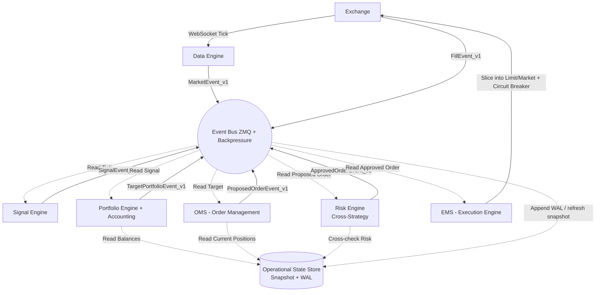

<div align="center">
 


[](#)
[](README_VI.md)

# KAIROS v3.2
### **A Fully Automated Mid-Frequency Quantitative Trading System with Low-Latency Architecture**

[](https://www.python.org/)
[](https://www.binance.com/)
[](https://opensource.org/licenses/MIT)

`Python` • `ETL Pipeline` • `Backtesting` • `Quant Analysis`

| Field | Value |
|-------|-------|
| Document Version | v3.5 |
| Last Updated | 2026-06-12 |
| Status | In Development — Layer 1 built & patched; Layer 3 ~95% |
| Scope | Architecture specification & implementation reference for KAIROS v3 |
| Test Coverage | 473 test functions / 18 files in `test/` (M-D0: 25, M-D1: 31, M-D2: 37, M-D3: 32, M-D4: 29, exits: 64, ...) |

<div align="left">
 
---

## Table of Contents

- [0. Read This First](#read-this-first)
- [1. Production Data Flow](#1--production-data-flow)
- [2. System Architecture (Directory Map)](#2--system-architecture-directory-map)
- [3. Module Specifications](#3--module-specifications)
  - [3.1. Configuration & Runtime](#31--configuration--runtime)
  - [3.2. Data Lake](#32--data-lake)
  - [3.3. Data Engine](#33--data-engine)
  - [3.4. Machine Learning & MLOps](#34--machine-learning--mlops-wip)
  - [3.5. Execution Core](#35--execution-core)
  - [3.6. Risk System](#36--risk-system)
  - [3.7. Infrastructure & Communication](#37--infrastructure--communication)
  - [3.8. Monitoring & Testing](#38--monitoring--testing)
- [4. Design Constraints & Engineering Decisions](#4--design-constraints--engineering-decisions)
- [8. Production Readiness Checklist](#8--production-readiness-checklist)

---

<a id="read-this-first"></a>
## 0. Read This First

Kairos is a mid-frequency trading engine with an architecture heavily optimized for low latency. This README should not be interpreted as confirmation that the system has achieved formal correctness for real-money trading across all failure modes. At many points, the current design prioritizes a latency-first approach; therefore, readers should carefully understand the assumptions and safety boundaries before reusing any components.

**Key concepts that must be understood correctly:**

- `Snapshot + WAL` should currently be understood as a **persistence backbone / operational truth source** for critical state. It should only be called a `Single Source of Truth` in the absolute sense when every mutation is required to pass through the WAL and replay always rebuilds to the same logical state.
- `Drop`, `coalescing`, `backpressure shedding`, and `fail-fast` are performance trade-offs; they are not inherently safe for real trading if dropped events could cause incorrect decisions or state divergence. In such cases, `gap detection`, `degraded mode`, or `halt` must be in place.
- `Deterministic replay` is only meaningful when the input stream, ordering, seed, timestamp semantics, and external side effects are all under control. Paper determinism does not equate to live determinism.
- `SPSC ring buffer`, `OCC retries`, and the `thread + asyncio` model all rely on strict assumptions. If these assumptions are not runtime-enforced or stress-tested, correctness may be violated even when latency metrics look good.
- `Integer-scaled arithmetic` only addresses `float` precision errors; it does not automatically handle `currency normalization`, `funding sign conventions`, `fee models`, or the differences between linear / inverse / coin-margined products.

**Minimum production gates before using this as a reference for a real-money engine:**

| Category | Minimum Requirements |
|----------|---------------------|
| Event correctness | `sequence_id`, separation of `event_time` / `ingest_time`, gap detection, explicit policy for out-of-order and drops |
| Persistence | Every state mutation passes through WAL, snapshot + replay rebuilds to the same logical state |
| Determinism | Same input → same output at the logical level, independent of thread scheduling or `time.time()` |
| Concurrency | Clear ownership or explicit lock strategy; OCC only applied to idempotent, retry-safe operations |
| Risk stop | Atomic global kill switch, explicit engine state machine `INIT -> SYNC -> RUNNING -> HALT` |
| Accounting | Base-currency normalization, funding/fee normalization, reconciliation with exchange |
| Integrity | Runtime invariant checks for orders, positions, balances, PnL |
| Testing | Replay, chaos, fault injection, restart recovery, race stress, invariant assertions |

**How to read the rest of this README:**

- The sections below primarily describe the `architecture`, `design intent`, and `hardening roadmap`.
- Terms such as `SSOT`, `deterministic`, `crash-safe`, `lock-free`, or `production` should be understood as conditional, not unconditional guarantees across all execution paths.
- If you want to use Kairos as a reference for a live system, verify thoroughly: event sequencing, WAL coverage, idempotency, state machine, invariant enforcement, exchange reconciliation, and kill consistency.

---

## 1. Production Data Flow

The design goal is to prevent critical state from being scattered across components. In this README, `Snapshot + WAL` should be understood as the **persistence backbone** and operational reference source for critical state, not as a claim that every mutation has been formalized as an absolute `Single Source of Truth` across all execution paths.



> For production use, each event should carry at minimum `sequence_id`, `event_time`, and `ingest_time`. If a gap, out-of-order event beyond the accepted window, or drop on a causal stream is detected, the system should transition to `degraded` or `halt` rather than assuming state remains correct.

---

## 2. System Architecture (Directory Map)

```text
KAIROS v3/
├── .env                                # API Keys, Passwords (NOT committed)
├── .gitignore
├── Dockerfile
├── Makefile                            # Command shortcuts (make train, make live)
├── main.py                             # Main entry point
├── requirements.txt                    # Python dependency management
├── README.md                           # You are reading this file
├── docs/                               # implementation_plan.md, data_flow_diagrams.md, system_objectives.md
├── prompt/                             # Module specs: layer1_data (M-D), layer3_live (M-L), layer4_hft (M-H)
│
# ==========================================
# 1. CONFIGURATION & RUNTIME
# ==========================================
├── cau_hinh/                           # (Config)
│   ├── adapter_loader.py               # Factory for loading Exchange Adapters from .env + universe.yaml
│   ├── config_loader.py                # Pydantic typed loaders for YAML files
│   ├── universe.yaml                   # Exchange adapters (timeout, rate) + Symbol master
│   ├── trading.yaml                    # Risk, OMS, PnL, Position Sync, Session, Strategy
│   ├── infra.yaml                      # Flow Control, Execution Protection, Alerting, Observability
│   ├── exchange_metadata.yaml          # Settlement times, funding intervals per exchange
│   ├── sector_map.yaml                 # [M-D3] Sector assignments seed
│   └── stablecoin_exclusion.yaml       # [M-D3] Stablecoin exclusion list for universe
│
├── moi_truong_chay/                    # (Runtime Environments) Absolute isolation
│   ├── live/                           # [NEW] Real-money trading — Live Orchestrator (production-oriented)
│   │   ├── live_runner.py              # [NEW] 12-Step SRE Startup + Health/Reconcile Daemons (882 lines)
│   │   └── live_config.yaml            # [NEW] SRE-grade tuning: health, reconciliation, cancel policy
│   ├── paper/                          # Paper trading (Testnet)
│   │   ├── audit_to_parquet.py         # Audit data conversion to Parquet
│   │   ├── microstructure_model.py     # Market microstructure simulation
│   │   ├── paper_ems_adapter.py        # Execution adapter for Paper Trading (711 lines)
│   │   ├── paper_runner.py             # Main runner script for Paper environment
│   │   ├── paper_state_manager.py      # Virtual order state management
│   │   └── shock_simulator.py          # Market shock simulator
│   ├── backtest/                       # Historical backtesting
│   └── upstream_runner.py              # Launcher for Data/Risk upstream processes
│
# ==========================================
# 2. DATA LAKE
# ==========================================
├── ho_du_lieu/                         # (Data Lake)
│   ├── tho/                            # (Raw) Immutable Parquet — M-D1 output
│   │   ├── {exchange}/{symbol}/        # [M-D1] 1h OHLCV bars + liquidation
│   │   │   └── year={Y}/month={M}/data.parquet
│   │   ├── {exchange}/{symbol}/long_short/  # [M-D1] 5min Long/Short ratio
│   │   │   └── year={Y}/month={M}/data.parquet
│   │   └── onchain/{asset}/{metric}/   # [M-D1] Hourly on-chain (CryptoQuant)
│   │       └── year={Y}/month={M}/data.parquet
│   ├── da_xu_ly/                       # Cleaned & synchronized data
│   ├── kho_dac_trung/                  # (Feature Store)
│   │   ├── offline/                    # For AI training
│   │   └── online/                     # In-memory cache for live inference
│   │      └── memory_store.py          # OnlineFeatureStore
│   ├── thuc_thi/                       # Live execution state (WAL + snapshot + sessions)
│   │   ├── nhat_ky_wal/                # kairos.wal, wal_log.jsonl, funding_dedup.jsonl
│   │   ├── snapshot/                   # state.json (KairosState atomic checkpoint)
│   │   ├── phien_giao_dich/            # sessions_YYYY-MM.ndjson / .parquet (P&L ledger)
│   │   └── audit/                      # Exit audit trail (daily rotation, 30-day retention)
│   ├── gia_lap/                        # Paper trading output
│   │   ├── paper_wal.jsonl             # Paper WAL
│   │   ├── paper_snapshot.json         # Paper state snapshot
│   │   ├── paper_audit_*.jsonl         # Fill audit trail (line-buffered)
│   │   └── parquet/                    # Converted Parquet (audit_to_parquet)
│   ├── settlement_spool/{exchange}/    # [M-D1] Persistent spool for settlement buffer
│   ├── dlq/{exchange}/                 # [M-D1] Dead Letter Queue per-exchange
│   ├── ket_noi/{exchange}/             # [M-D1] WS gap logs (gaps_{date}.jsonl)
│   ├── quarantine/                     # [M-D1] Orphan Parquet quarantine
│   ├── giam_sat/                       # Monitoring & alerting output
│   │   └── canh_bao/                   # Alert fallback logs (RotatingFileHandler)
│   └── he_thong/                       # System sentinel files (gitignored — runtime only)
│       ├── system.KILLED               # Kill-switch JSON (blocks all Gateway restarts)
│       └── FLATTEN_LOCK                # Written by EmergencyFlattener (blocks all new trades)
│
# ==========================================
# 3. DATA ENGINE
# ==========================================
├── dong_co_du_lieu/                    # (Data Engine)
│   ├── quan_ly_phien_ban/              # [M-D0] Data Lineage Registry (8 files)
│   │   ├── __init__.py                 # Public API export
│   │   ├── _locking.py                 # Cross-platform file lock (msvcrt/fcntl)
│   │   ├── dataset_record.py           # DatasetRecord + content/schema hash + write_and_register()
│   │   ├── exceptions.py               # Custom exception hierarchy (LineageError, PIT failures)
│   │   ├── lineage_registry.py         # Append-only JSONL registry, as_of() PIT query
│   │   ├── pit_verifier.py             # verify_pit_production() stratified sampling (500+ rows)
│   │   ├── symbol_lifecycle_poller.py  # Daemon daily poll → state-based interval tracking
│   │   └── verification_registry.py    # VerificationRecord + verification log
│   ├── thu_thap/                       # [M-D1] Raw Data Ingestion (11 modules)
│   │   ├── bar_types.py                # BarData dataclass — full M-D1 schema
│   │   ├── bar_processor.py            # compute_dq_flags, attach_oi_to_bar, write_parquet_atomic
│   │   ├── settlement_buffer.py        # T+5min funding buffer + persistent spool
│   │   ├── dead_letter_queue.py        # Rolling 1h window per-exchange, route_to_dlq
│   │   ├── funding_interval_cache.py   # Settlement minutes cache + funding poll loop
│   │   ├── liquidation_aggregator.py   # Thread-safe per-bar LiquidationEvent aggregation
│   │   ├── aux_parquet_writer.py       # Long/Short ratio + On-chain Parquet writer
│   │   ├── schema_validator.py         # Schema validation: OHLCV + Long/Short + On-chain
│   │   ├── startup_routines.py         # Orphan scan + SIGTERM handler
│   │   ├── symbol_remapper.py          # Exchange symbol → canonical asset_id (date-range)
│   │   ├── websocket/                  # Real-time streaming
│   │   │   ├── binance_ws.py           # BinanceGateway
│   │   │   ├── okx_ws.py              # OkxGateway
│   │   │   └── bybit_ws.py            # BybitGateway
│   │   └── rest_api/                   # Periodic polling
│   │       ├── base_rest.py            # BaseRestPoller
│   │       ├── binance_rest.py         # BinanceRestPoller
│   │       ├── okx_rest.py             # OkxRestPoller
│   │       ├── bybit_rest.py           # BybitRestPoller
│   │       └── onchain_rest.py         # CryptoQuantPoller
│   ├── xu_ly_dong/                     # (Stream Processor)
│   │   └── bo_loc/
│   │       ├── orderbook_engine.py     # L2 Sync Engine
│   │       └── ohlc_engine.py          # OHLCV Aggregator
│   ├── xu_ly_lo/                       # [M-D2] Batch Processor — Gap Reconciliation (8 files)
│   │   ├── reconcile.py                # [M-D2] Main orchestrator steps 0–7, CLI + batch runner
│   │   ├── schema_validator.py         # [M-D2] MD2_SCHEMA explicit PyArrow, write_with_schema_version()
│   │   ├── maintenance_event_logger.py # [M-D2] Daemon poll → maintenance_log_{date}.parquet + heartbeat
│   │   ├── gap_detector.py             # [M-D2] Missing/zombie detection, gap manifest (immutable fields)
│   │   ├── rest_filler.py              # [M-D2] REST fill, continuity + boundary validation (async)
│   │   ├── quality_tagger.py           # [M-D2] data_quality 0–4, coverage report
│   │   ├── reconcile_funding_rates.py  # [M-D2] funding_rate_raw, anti-lookahead, stale propagation
│   │   ├── pit_universe.py             # [M-D3] PiTUniverseManager, AssetRegistry, snapshot builder
│   │   ├── symbol_remapper.py          # [M-D3] RENAME/FORK corporate actions, symbol history
│   │   ├── seed_sector_assignments.py  # [M-D3] One-time seeder: sector_map.yaml → DB
│   │   ├── feature_cache.py            # [M-D4] FeatureCache, atomic write, cache_hash, BTC-first
│   │   └── pre_aggregate_l2.py         # [M-D4] L2→OFI, binary snapshot store (NEVER delete)
│   └── ong_dan_dac_trung/              # (Feature Pipeline) <10µs/tick
│       └── online/
│           ├── feature_registry.py     # FEATURE_REGISTRY + CompiledPlan
│           └── incremental_engine.py   # IncrementalFeatureEngine
│
# ==========================================
# 4. MACHINE LEARNING
# ==========================================
├── hoc_may/                            # (Machine Learning)
│   ├── mo_hinh/                        # (Models) LSTM, Transformer — [PLANNED, not yet implemented]
│   ├── huan_luyen/                     # Model training scripts
│   ├── suy_luan/                       # ONNX/TensorRT Inference
│   ├── to_hop_alpha/                   # (Alpha Combiner)
│   └── giam_sat_mo_hinh/              # (ML Monitoring)
│       ├── sai_lech_dac_trung/         # Feature Drift
│       └── sai_lech_du_doan/           # Prediction Drift
│
# ==========================================
# 5. EXECUTION CORE
# ==========================================
├── thuc_thi_lenh/                      # (Execution Core)
│   ├── bo_nho_trang_thai/              # [PERSISTENCE BACKBONE / STATE STORE]
│   │   ├── snapshot/                   # Periodic state dump every 5s
│   │   ├── nhat_ky_wal/                # Write-Ahead Log
│   │   │   └── durable_wal.py          # War-Grade WAL (mmap + CRC32)
│   │   ├── vi_the/                     # (Positions)
│   │   ├── so_lenh/                    # (Orders)
│   │   ├── so_du/                      # (Balances)
│   │   └── state_manager.py            # System state manager
│   ├── cong_ket_noi/                   # (Gateway) Binance/Bybit/OKX
│   │   ├── base_adapter.py
│   │   ├── binance_adapter.py
│   │   ├── bybit_adapter.py
│   │   ├── okx_adapter.py
│   │   └── chien_luoc_thu_lai/         # [NEW] Smart Retry + Protection Stack
│   │       ├── circuit_breaker.py      # Weighted CB: CLOSED→OPEN→HALF_OPEN
│   │       ├── execution_wrapper.py    # Intent Lifecycle + Integrated Protection
│   │       ├── rate_limiter.py         # Adaptive Token Bucket + EWMA Latency
│   │       └── retry_policy.py         # Decorrelated Jitter + Deadline-Aware
│   ├── dong_co_tin_hieu/               # (Signal Engine)
│   │   ├── ml_signal_engine.py
│   │   └── mock_onnx_generator.py
│   ├── quan_ly_danh_muc/               # (Portfolio Engine)
│   │   ├── funding_collector.py        # [NEW] Periodic Funding Collection + NDJSON Dedup
│   │   ├── position_sync.py            # [NEW] Startup Sync + Drift Detection + Healing
│   │   ├── session_manager.py          # [NEW] Daily P&L Session Rotation + Archive
│   │   ├── ke_toan_pnl/                # [NEW] Accounting: Realized/Unrealized PnL
│   │   │   ├── pnl_aggregator.py       # Root PnL Orchestrator (622 lines)
│   │   │   ├── pnl_tracker.py          # Integer-Scaled Realized PnL + OCC
│   │   │   ├── fee_ledger.py           # Trade Fees + Funding Payments
│   │   │   └── mark_to_market.py       # Live Mark Price + Unrealized PnL
│   │   └── thoat_vi_the/               # [NEW] Exit Management System (EMS Exit Layer)
│   │       ├── exit_coordinator.py     # [NEW] State machine + strategy dispatch (411 lines)
│   │       ├── position_state.py       # [NEW] FLAT→OPEN→CLOSING→PARTIAL→CLOSED→QUARANTINED
│   │       ├── position_sizer.py       # [NEW] Anti-flip qty calculator
│   │       ├── audit_logger.py         # [NEW] Append-only exit audit trail (daily rotation)
│   │       ├── base_strategy.py        # [NEW] ExitStrategy ABC, ExitDecision, ExitContext
│   │       ├── composite.py            # [NEW] First-trigger-wins by urgency
│   │       └── strategies/
│   │           ├── fixed_percent.py    # [NEW] SL/TP fixed %
│   │           ├── atr_based.py        # [NEW] ATR-based SL/TP (per-symbol state)
│   │           ├── trailing_stop.py    # [NEW] Trailing stop with activation threshold
│   │           ├── breakeven.py        # [NEW] Move SL to breakeven after trigger %
│   │           ├── partial_exit.py     # [NEW] Partial close at multiple TP levels
│   │           └── time_based.py       # [NEW] Max hold time forced exit
│   ├── danh_ba_chien_luoc/             # (Strategy Registry)
│   ├── quan_ly_lenh/                   # [NEW] (OMS) Order Management System
│   │   ├── order_book.py               # In-Memory Order Book + Per-Symbol Lock (656 lines)
│   │   ├── reconciler.py               # Exchange Reconciliation + Cancel-All
│   │   └── oms_serializer.py           # Binary WAL Payload Codec (32B)
│   ├── dong_co_thuc_thi/               # (EMS) Execution Management
│   │   ├── ems.py
│   │   └── execution_risk_engine.py
│   ├── theo_doi_do_tre/                # (Latency Tracker)
│   └── vong_lap_su_kien.py             # (Event Loop) — 1105 lines, the heart of the system
│
# ==========================================
# 6. RISK SYSTEM
# ==========================================
├── quan_tri_rui_ro/                    # (Risk Management)
│   ├── rui_ro_cheo_chien_luoc/         # Cross-Strategy Risk
│   │   ├── bu_tru_vi_the/              # Exposure Netting
│   │   └── xung_dot_tin_hieu/          # Conflict Detector
│   ├── kiem_tra_truoc_lenh/            # Pre-trade Risk (risk_gate.py 557 lines)
│   │   ├── rules/
│   │   │   ├── base_rule.py
│   │   │   ├── global_rules.py         # MaxDailyLoss, MaxDrawdown
│   │   │   ├── position_rules.py       # MaxOpenOrders, Concentration
│   │   │   └── rate_rules.py           # OrderRate, DuplicateGuard
│   │   ├── reconciliation.py
│   │   ├── risk_codes.py
│   │   └── risk_gate.py                # Primary risk control gate
│   └── nguoi_gac_cong/                 # (Watchdog) Kill Switch
│       └── watchdog/
│           ├── watchdog.py
│           ├── emergency_flattener.py  # [NEW] Standalone REST flatten Binance/OKX/Bybit (374 lines)
│           └── adapters/
│               ├── lite_rest.py
│               └── war_grade_rest.py
│
# ==========================================
# 7. INFRASTRUCTURE
# ==========================================
├── ha_tang/                            # (Infrastructure)
│   ├── bus_su_kien/                    # (Event Bus) ZeroMQ
│   │   ├── zmq_bus.py                  # AsyncEventBus PUB/SUB
│   │   ├── luoc_do_du_lieu/v1/         # Event Schema Versioning
│   │   │   ├── base_event.py
│   │   │   ├── market_schema.py
│   │   │   ├── state_schema.py
│   │   │   ├── feature_schema.py       # _FeatureEventRaw (192B ctypes)
│   │   │   ├── execution_schema.py
│   │   │   └── signal_schema.py        # _SignalEventRaw (64B ctypes)
│   │   └── kiem_soat_luu_luong/        # Backpressure Control
│   │       ├── drop_policy/
│   │       │   └── shedder.py          # Adaptive Shedder (EWMA)
│   │       └── priority_channel/
│   │           └── channel_manager.py  # SPSC Multi-Queue
│   ├── bo_nho_chung/                   # (Shared Memory)
│   └── dong_ho_thoi_gian/
│       └── time_validator.py           # PTP/NTP Clock Validation
│
# ==========================================
# 8. MONITORING & TESTING
# ==========================================
├── giam_sat/                           # (Monitoring)
│   ├── chi_so_hieu_suat/               # System Metrics
│   │   ├── collector.py                # Dedicated OS Thread collector
│   │   └── reporter.py                 # ZMQ reporter
│   ├── canh_bao/                       # Alerts
│   │   ├── alert_manager.py
│   │   ├── alert_rules.py
│   │   └── telegram_sender.py
│   └── theo_doi_do_tre/                # Latency Tracking
│       ├── histogram.py                # HdrHistogram zero-alloc
│       ├── reporter.py
│       └── tracker.py                  # 4-segment latency tracker
├── kiem_thu/
│   └── san_gia_lap/                    # Mock Exchange
├── test/                               # Unit & Integration Tests (473 test functions / 18 files)
│   ├── test_live_runner.py             # Live Runner — 14 components, 966 lines
│   ├── test_chaos_risk.py              # Pre-trade Risk Gate adversarial scenarios
│   ├── test_execution_pipeline.py      # Execution layer: Retry, TokenBucket, RiskEngine, Adapters
│   ├── test_feature_layer.py           # Feature engine pipeline
│   ├── test_rest_api.py                # REST API adapter tests
│   ├── test_signal_engine.py           # ML signal engine
│   ├── test_profiler.py                # Performance profiling
│   ├── test_state.py                   # KairosState WAL/snapshot
│   ├── test_position_sizer.py          # PositionSizer — 14 tests (qty, anti-flip, lot rounding)
│   ├── test_strategies.py              # Exit strategies — 32 tests (6 strategies + composite)
│   ├── test_exit_coordinator.py        # ExitCoordinator — 18 tests (state machine, cooldown, quarantine)
│   ├── test_exit_e2e.py                # Exit system end-to-end integration
│   ├── test_d0_lineage.py              # [M-D0] Data Lineage Registry — 25 tests
│   ├── test_d1_ingestion.py            # [M-D1] Raw Data Ingestion — 31 tests
│   ├── test_d2_gap_reconciliation.py   # [M-D2] Gap Reconciliation — 37 tests (T-D2.1→T-D2.32)
│   ├── test_d3_pit_universe.py         # [M-D3] PiT Universe Manager — 32 tests (T-D3.1→T-D3.30)
│   ├── test_d4_feature_cache.py        # [M-D4] Feature Cache — 29 tests (T-D4.1→T-D4.19)
│   ├── test_paper_adapter_queries.py   # Paper adapter query tests (10 tests)
│   ├── test_position_funding.py        # Position + Funding tests (13 tests)
│   └── test_session_pnl.py             # Session + PnL tests (20 tests)
│
# ==========================================
# 9. OPERATIONAL SCRIPTS
# ==========================================
└── kich_ban/                           # (Scripts)
    ├── __init__.py                     # Package marker
    ├── khoi_dong.py                    # Core stack launcher: preflight, process manager, shutdown (147 lines)
    ├── khoi_dong_live.py               # Live-money entry point: `make live`
    ├── khoi_dong_paper.py              # Paper-trading entry point: `make paper-launch`
    └── dao_tao_lai_model.py            # ML model re-training pipeline
```

---

## 3. Module Specifications

### Component Status

| Module | Primary File(s) | Lines | Status | Tests |
|--------|-----------------|-------|--------|-------|
| **M-D0: Data Lineage** | `quan_ly_phien_ban/` (8 files) | ~1600 | Implemented | `test_d0_lineage.py` (25 tests) |
| **M-D1: Raw Ingestion** | `thu_thap/` (11 modules) | ~2200 | Implemented | `test_d1_ingestion.py` (31 tests) |
| **M-D2: Gap Reconciliation** | `xu_ly_lo/` (8 files) | ~2800 | Implemented | `test_d2_gap_reconciliation.py` (37 tests) |
| **M-D3: PiT Universe Manager** | `xu_ly_lo/` (3 files) | ~750 | Implemented | `test_d3_pit_universe.py` (32 tests) |
| **M-D4: Feature Cache** | `xu_ly_lo/` (2 files) + `khung_alpha/` (3 files) | ~900 | Implemented | `test_d4_feature_cache.py` (29 tests) |
| Live Orchestrator | `live_runner.py` | 882 | Implemented | `test_live_runner.py` (14 components) |
| Paper EMS Adapter | `paper_ems_adapter.py` | 711 | Implemented | `test_paper_adapter_queries.py` (10 tests) |
| Execution Gateway | `vong_lap_su_kien.py` | 1105 | Implemented | `test_execution_pipeline.py` |
| OMS — OrderBook | `order_book.py` | 656 | Implemented | — |
| PnL Aggregator | `pnl_aggregator.py` | 622 | Implemented | `test_session_pnl.py` (20 tests) |
| Session Manager | `session_manager.py` | 575 | Implemented | `test_session_pnl.py` |
| Risk Gate | `risk_gate.py` | 557 | Implemented | `test_chaos_risk.py` |
| Position Synchronizer | `position_sync.py` | 383 | Implemented | `test_position_funding.py` (13 tests) |
| Execution Wrapper | `execution_wrapper.py` | 380 | Implemented | — |
| Feature Engine | `incremental_engine.py` | 353 | Implemented | `test_feature_layer.py` |
| Reconciler | `reconciler.py` | 346 | Implemented | — |
| Durable WAL | `durable_wal.py` | 290 | Implemented | `test_state.py` |
| Funding Collector | `funding_collector.py` | 234 | Implemented | `test_position_funding.py` |
| Exit Coordinator | `thoat_vi_the/exit_coordinator.py` | 411 | Implemented | `test_exit_coordinator.py` (18 tests) |
| Emergency Flattener | `watchdog/emergency_flattener.py` | 374 | Implemented | — |
| Position State | `thoat_vi_the/position_state.py` | 75 | Implemented | — |
| Position Sizer | `thoat_vi_the/position_sizer.py` | 51 | Implemented | `test_position_sizer.py` (14 tests) |
| Exit Strategies (×6) | `thoat_vi_the/strategies/` | 309 | Implemented | `test_strategies.py` (32 tests) |
| ML / ONNX Inference | `hoc_may/suy_luan/` | — | Build Phase 2 | — |
| Stack Launchers | `kich_ban/` | 147 | Implemented | — |


**Performance design principles:** The hot-path completely eliminates GC (`gc.disable()`), uses pre-allocated ctypes structs instead of Python objects, employs lock-free SPSC ring buffers, and avoids locks on the critical path as long as the SPSC assumption holds.

---

### 3.1. Configuration & Runtime

The highest-level orchestration module, combining static parameter management with the Paper Trading simulation architecture.

#### Static Configuration (`cau_hinh/`)

Complete separation of logic and parameters. No values are hardcoded in source code:

* `universe.yaml` — Exchange adapters (timeout, Token Bucket rate/capacity for Binance/Bybit/OKX) + Symbol master: maps trading pairs to integer `symbol_id` for O(1) array lookups on the hot-path, defines `qty_step`, `price_step`, `max_pos_usdt`.
* `trading.yaml` — All trading parameters: Risk Gate (`max_daily_loss_usdt`, `max_drawdown_pct`), OMS (`segment_rotation_count: 60000`, `archive_max_size: 50000`), PnL (`scale_factor: 1e8`, `checkpoint_every: 1000`), Position Sync, Funding, Session rotation, Strategy (`vector_size`).
* `infra.yaml` — Operational infrastructure: Flow Control (CRITICAL queue `100k`, drain budget `200µs`, EWMA Adaptive Shedder), Execution Protection (Rate Limiter, Circuit Breaker, Retry — under `execution:` key), Alerting Telegram + rules (under `alerting:` key), System Metrics observability (under `observability:` key).
* `adapter_loader.py` — Factory that automatically loads configuration combined with `.env` environment variables:

```python
# cau_hinh/adapter_loader.py
def build_adapters(env_path, exchanges_yaml, active_exchanges):
    """Automatically initialize Exchange Adapters from config files."""
    active = list({cfg.exchange for cfg in configs.values()})
    adapters = build_adapters(env_path, exchanges_yaml, active_exchanges=active)
```

#### Paper Trading Environment (`moi_truong_chay/paper/`)

Not a simplistic "mock". This is an internal exchange that simulates market microstructure with a **19-Step Fill Pipeline**:

* **Seeded & Replay-friendly**: Every order is assigned a `SHA256-seeded RNG` to minimize variance between paper/replay runs. This is a determinism property within the scope of the simulator; it does not equate to live determinism or external consistency with real exchanges.
* **Latency Jitter**: Heavy-tailed Lognormal distribution simulating realistic network jitter. Orders are not filled "instantly" as in conventional libraries.
* **Orderbook Perturbation (Spoofing)**: Automatic orderbook erosion, simulating Liquidity Mirages and Iceberg orders.
* **Slippage (Kyle's Alpha)**: Applies Kyle's Alpha model to compute self-impact. Continuously generates Toxicity / Adverse Selection ratios.
* `microstructure_model.py` — Background process listening on ZMQ, tracking Volatility, Order Flow Imbalance, and computing cross-asset risk contagion coefficients (Contagion: BTC crash → ALT cascade) within a 500ms window.
* `shock_simulator.py` — Simulates sudden market shocks (Flash Crash, Liquidation Cascade) to stress-test risk management algorithms.

#### Live Trading Environment (`moi_truong_chay/live/`) — Live Orchestrator (production-oriented)

`live_runner.py` — **882 lines**, the module that bootstraps the entire real-money trading pipeline. Follows an **SRE-grade 12-Step Fail-Fast Startup** architecture:

```
Step  1: system.KILLED check           ← Abort immediately if sentinel exists
Step  2: Load live_config.yaml         ← SRE tuning parameters
Step  3: Load universe.yaml + secrets  ← Symbols + API keys
Step  4: Init Exchange Adapters        ← Binance/Bybit/OKX with dedicated httpx.AsyncClient
Step  5: Balance check                 ← Fail-fast if < min_startup_balance_usdt
Step  6: Init KairosState (WAL-first)  ← Crash-recovery from WAL → Snapshot
Step  7: Init ExecutionGateway         ← Ring buffer + 5 threads
Step  8: Startup Reconciliation        ← Cancel sweep + orphan fill detection
Step  9: Flush ZMQ stale signals       ← Drain stale messages
Step 10: Launch Health Daemon          ← 401/403/5xx/429 monitoring
Step 11: Launch Reconcile Daemon       ← Periodic state sync
Step 12: Launch KillSwitch Monitor     ← system.KILLED file polling
```

**3 Core Operational Principles:**

* **Absolute Physical Rate Isolation**: Each daemon (Health, Reconcile, Hot-Path) initializes its own `httpx.AsyncClient` and `TokenBucket` **completely independently**. Connection pools and rate quotas are never shared between background monitoring and the execution path — preventing health checks from consuming the rate limit budget allocated for trade orders.

* **Crash-Consistency (WAL First)**: When recovering after a crash, the mandatory sequence is: Read internal WAL (retrieve in-flight orders) → Fetch from exchange (retrieve filled orders) → Compare. If an orphan fill is detected (exchange has a position that the WAL does not record), that symbol is **HALTed** immediately. This is the intended contract; it is only trustworthy when no mutation path bypasses the WAL or external side effects remain unreconciled.

* **CoalescingQueue**: A specialized queue for reconciliation snapshots — when full, it automatically drops the oldest snapshot instead of blocking the producer. This mechanism should only be applied to replaceable snapshot/telemetry data; it should not be interpreted as meaning every causal event is safe to drop.

> `Fail-fast`, `drop`, and `coalescing` at the operational layer are latency trade-offs. If a dropped event could corrupt portfolio/order state, the engine should self-mark as `degraded`, run recovery, or `halt` rather than continue treating state as authoritative.

**SRE Configuration** (`live_config.yaml`):

```yaml
live:
  health_check:
    interval_s: 60.0           # Check balance + latency every 60s
    max_failures: 3            # 3 consecutive 5xx errors → safe_hard_kill
    latency_threshold_ms: 1000 # Alert if exchange response > 1s
  reconciliation:
    interval_s: 120.0          # State reconciliation every 2 minutes
    max_drift_s: 600.0         # If > 10 minutes without sync → force sync immediately
    max_pressure: 0.70         # Skip sync if gateway backpressure > 70%
  cancel_policy:
    mode: "ALL"                # Cancel all open orders at startup
    cooldown_s: 10.0           # Wait 10s after cancel for exchange to settle
```

---

### 3.2. Data Lake

Cold-Storage architecture, optimized for vectorized backtesting across billions of rows.

#### Raw Data (`ho_du_lieu/tho/`) — M-D1 Output

Never modified (Immutable). Stored in Snappy-compressed Parquet format using **Year/Month Partitioning**. Every Parquet file after write MUST be registered with the M-D0 `LineageRegistry`.

* `{exchange}/{symbol}/year={Y}/month={M}/data.parquet` — **1h OHLCV Bar** (17 columns): event_time_ns, OHLCV, funding_rate, oi_usdt, liquidation_buy/sell_usdt, dq_flags, is_settlement_bar, is_backfill.
* `{exchange}/{symbol}/long_short/year={Y}/month={M}/data.parquet` — **Long/Short Ratio** (5min, 7 columns): timestamp_ns, long_short_ratio, long/short_account_ratio.
* `onchain/{asset}/{metric}/year={Y}/month={M}/data.parquet` — **On-chain Data** (hourly, 6 columns): exchange_reserve, exchange_netflow, stablecoin_supply from CryptoQuant.

#### Online Feature Store (`ho_du_lieu/kho_dac_trung/online/memory_store.py`)

**291 lines**, an ultra-fast in-memory cache serving live inference. Designed to achieve **zero-allocation on the hot-path**:

```python
# ho_du_lieu/kho_dac_trung/online/memory_store.py
class OnlineFeatureStore:
    """Pre-allocated, cache-line-aligned feature store for MAX_SYMBOLS symbols."""

    def __init__(self, max_symbols: int = 256) -> None:
        # ── Main store: NumPy structured array, 192 bytes/symbol ──
        self._store = np.zeros(max_symbols, dtype=FEATURE_EVENT_DTYPE)

        # ── Pre-compute destination pointers (startup cost, zero hot-path alloc) ──
        self._feat_ptrs: list[int] = [
            int(self._feat_col[i].ctypes.data) for i in range(max_symbols)
        ]
```

**Anti-False-Sharing Design**: `FEATURE_EVENT_DTYPE.itemsize == 192 bytes` (exactly 3 × 64B cache lines). Symbols at index `i` and `i+1` start at offsets `192*i` and `192*(i+1)` — the first 64B header never shares a cache line.

**Reorder Buffer (ROB)**: In crypto markets, due to network latency, WebSocket streams frequently deliver out-of-order packets. Computing OFI or EMA on disordered data produces incorrect results. The ROB is a "waiting room" that holds early-arriving ticks within a 5ms window. At expiration, the system flushes using an ultra-lightweight **In-place Insertion Sort** algorithm, since the array typically has only 1-3 disordered elements:

> The ROB is only a heuristic reorder window, not an absolute "ground-truth timeline". If exchange timestamps are inconsistent or events arrive beyond the window, features should clearly distinguish `event_time` from `processing_time`, and an explicit policy for late events is needed rather than assuming reordering alone guarantees correctness.

```python
# In-place insertion sort — n ≤ 64, typically only 1-3 elements
for i in range(1, n):
    key_ts   = int(buf[i, 0])
    key_slot = int(buf[i, 1])
    j = i - 1
    while j >= 0 and int(buf[j, 0]) > key_ts:
        buf[j + 1, 0] = buf[j, 0]
        buf[j + 1, 1] = buf[j, 1]
        j -= 1
    buf[j + 1, 0] = key_ts
    buf[j + 1, 1] = key_slot
```

**Zero-Allocation Write** — `_write_to_store()` writes directly to the NumPy structured array without creating any Python objects:

```python
# memory_store.py — _write_to_store()
def _write_to_store(self, idx, raw, effective_mask):
    """Zero-allocation write to main store."""
    s = self._store   # single attribute lookup, not a copy
    # Column-first access: write directly to int64/uint64 arrays
    # Does NOT create intermediate numpy.void objects
    s["exchange_ts"][idx]            = raw.exchange_ts
    s["receive_ts"][idx]             = raw.receive_ts
    s["processed_ts"][idx]           = raw.processed_ts
    s["source_latency_ns"][idx]      = raw.source_latency_ns
    s["computation_latency_ns"][idx] = raw.computation_latency_ns
    s["feature_mask"][idx]           = effective_mask
    # ctypes.memmove: copy 128 bytes feature block at C speed
    ctypes.memmove(self._feat_ptrs[idx], ctypes.addressof(raw.features), _FEAT_BYTES)
```

> **Why Column-first instead of Row indexing?** Writing `self._store[idx]["exchange_ts"] = ...` (row-first) causes NumPy to create a temporary `numpy.void` object — that is, 1 allocation per tick. Column-first `self._store["exchange_ts"][idx] = ...` writes directly to the array, completely bypassing the Python object layer.

**Lockless `_drop_mask` Read** — When `signal_congestion()` changes `_drop_mask` from the monitor thread, the hot-path reads the new value **without any lock**. CPython's GIL guarantees that `LOAD_ATTR` (reading an integer) is atomic at the bytecode level. Adding a lock would cost ~100ns/tick — meaningless since the value only changes every few seconds.

```python
# commit_raw() — hot-path, NO lock
effective_mask = raw.feature_mask & ~self._drop_mask   # GIL-atomic int read
if effective_mask == 0:
    return False   # All features dropped → skip this tick
```

**Priority Degradation API** — 3 Backpressure levels:

| Level | Behavior | Purpose |
|-------|----------|---------|
| 0 | Normal — write all features | Normal operation |
| 1 | Drop Trade-derived (Welford, EMA, OFI) | Reduce load when system begins to congest |
| 2 | Drop ALL market features | Retain only Risk/Liquidation sentinel |

---

### 3.3. Data Engine

**Performance contract:** Latency budget **< 10–50µs/tick** from WebSocket receive to feature ready in `OnlineFeatureStore`.


#### M-D0: Data Lineage Registry (`dong_co_du_lieu/quan_ly_phien_ban/` — 8 files)

Immutable dataset registry — every Parquet artifact must be registered before use in backtesting.

* `dataset_record.py` — `DatasetRecord` + `VerificationRecord`, canonical Arrow IPC hash, `write_and_register()` atomic
* `lineage_registry.py` — Append-only JSONL, `as_of()` PIT query, orphan sweep
* `pit_verifier.py` — `verify_pit_production()` stratified 500+ rows, timestamp unit heuristic (s/ms/ns)
* `symbol_lifecycle_poller.py` — Daemon daily poll → state-based interval tracking
* **Tests:** 25 unit tests (`test/test_d0_lineage.py`)

#### M-D1: Raw Data Ingestion (`dong_co_du_lieu/thu_thap/` — 10 new modules)

Receives bars from WS/REST → QC → buffer settlement → write Parquet → register with M-D0.

* **WebSocket Gateway** (Binance, OKX, Bybit): `binance_ws.py`, `okx_ws.py`, `bybit_ws.py`
* **REST API Pollers**: OI (5m), Funding (1h), L/S Ratio (5m), Klines (1m), On-chain (CryptoQuant)
* `bar_processor.py` — `compute_dq_flags()` 4-bit bitmask, `attach_oi_to_bar()` (INV-D1.11 >= boundary), `write_parquet_atomic()`
* `settlement_buffer.py` — T+5min funding buffer + persistent spool (int64 serialized as string, INV-D1.24)
* `dead_letter_queue.py` — Rolling 1h window per-exchange, alert when rate > 1% and > 100 msgs
* `funding_interval_cache.py` — Settlement minutes cache (minutes not hours, INV-D1.5), Bybit stale detection
* `liquidation_aggregator.py` — Thread-safe per-bar aggregation of `LiquidationEvent`
* `aux_parquet_writer.py` — Long/Short ratio + On-chain Parquet separate writers
* `schema_validator.py` — 3 schemas: OHLCV (17 cols), Long/Short (7 cols), On-chain (6 cols)
* `startup_routines.py` — Orphan scan + SIGTERM handler

**Output:** `ho_du_lieu/tho/{exchange}/{symbol}/` (OHLCV+liquidation) | `.../long_short/` (5min) | `.../onchain/` (hourly)
* **Tests:** 31 unit tests (`test/test_d1_ingestion.py`)

#### M-D2: Gap Reconciliation (`dong_co_du_lieu/xu_ly_lo/` — 8 files)

Nightly batch running at 02:00 UTC, receives raw bars from M-D1 → detects gaps → fills from REST → assigns `data_quality` → merges funding rates → writes clean Parquet.

* `reconcile.py` — 7-step orchestrator: daemon heartbeat check → lifecycle → maintenance windows → gap manifest → fill/classify → funding merge → atomic write + coverage report
* `schema_validator.py` — `MD2_SCHEMA` explicit PyArrow (26 columns), `write_with_schema_version()` atomic, schema_version=1 mandatory
* `maintenance_event_logger.py` — Daemon poll exchange status every 5min → `maintenance_log_{date}.parquet` + `daemon_heartbeat.json`; stale > 15min → quality=3
* `gap_detector.py` — Missing bar scan + zombie volume detection (MAD robust_zscore, two-tail, baseline from history only — no look-ahead); gap manifest immutable detection fields
* `rest_filler.py` — `fill_gap() → (DataFrame, quality, reason)` with reason authoritative for fill_outcome; intra-gap continuity (4 checks) + symmetric boundary validation; HTTP 418/429 backoff
* `quality_tagger.py` — `data_quality` 0–4; daemon stale → mark bars with quality=3 (not skip); `compute_coverage_report()` aggregate from batch runner
* `reconcile_funding_rates.py` — `funding_rate_raw` + anti-lookahead (`funding_published_ns ≤ close_time_ns`); `received_ns` set after response; `_check_funding_cache_freshness()` in `load_funding_schedule()`; FAIL LOUD on cache miss

**Output:** `ho_du_lieu/da_xu_ly/` (clean bars, 26 cols) | `ho_du_lieu/gap_manifest/` (audit) | `ho_du_lieu/bao_cao_phu_song/` (daily coverage)

**`data_quality` enum:** 0=WS native | 1=REST filled | 2=suspect (zombie/boundary) | 3=missing | 4=scheduled_maintenance
* **Tests:** 37 unit tests (`test/test_d2_gap_reconciliation.py`) — T-D2.1 → T-D2.32

#### M-D3: Point-in-Time Universe Manager (`dong_co_du_lieu/xu_ly_lo/` — 3 files)

**The most critical anti-survivorship-bias module.** Manages the universe using `known_at` semantics: `get_universe(date)` only includes assets that KAIROS knew about before 00:00 UTC of that date.

* `pit_universe.py` — `make_asset_id()` UUID v5 per listing event (deterministic, avoids ticker collision LUNA/LUNA2); `AssetRegistry` SQLite (6 tables, WAL mode, write-once trigger); `PiTUniverseManager.get_universe()` / `get_universe_history()` / `get_asset_id()`; `build_daily_snapshot()` eligibility formula (ADV, OI, coverage, funding dysfunction, stablecoin); `process_exchange_poll()` listing/delist detection; circuit breaker > 50% universe missing; `pit_audit()` verify INV-D3.1/D3.2/D3.3/D3.20
* `symbol_remapper.py` — `apply_rename()` RENAME: asset_id PRESERVED; `apply_fork()` FORK: new asset_id; `flag_ambiguous_rename()` → review queue JSONL for manual review
* `seed_sector_assignments.py` — One-time seeder: `cau_hinh/sector_map.yaml` → `sector_assignments` table; explicit override for LUNA-style ticker collision

**Lifecycle (Phase 0):** `ACTIVE` → `SUSPECTED_DELIST` → `DELISTED` (terminal). False alarm: `SUSPECTED_DELIST` → `ACTIVE`. Dual condition confirmation: ≥3 polls + ≥12h wall-clock.

**Output:** `ho_du_lieu/lich_su_vu_tru/{date}__{built_at}.parquet` (versioned immutable) + `manifest.json` (append-only)
* **Tests:** 32 unit tests (`test/test_d3_pit_universe.py`) — T-D3.1 → T-D3.30

#### M-D4: Feature Cache (`xu_ly_lo/` + `khung_alpha/` — 5 files)

Pre-computes and caches feature matrices. Cache is invalidated by feature logic hash when logic changes.

* `khung_alpha/feature_spec.py` — `FeatureSpec` frozen dataclass (11 fields); `FEATURE_SPECS` 12 entries (return_1h/4h, funding_raw/z, oi_1h/4h, volume_ratio, basis, btc_neutral_1h/4h, spread, book_pressure); DAG cycle validation at import time (INV-D4.24)
* `khung_alpha/feature_registry.py` — `FEATURE_REGISTRY` 12 module-level `FeatureFn`; Winsorize [1%,99%] rolling 90d for return_1h/4h; 5×IQR outlier flag for funding_raw + oi_change; Welford expanding z-score funding_z_30d (INV-D4.19); Rolling OLS 504 bars btc_neutral + BTC 20% coverage check (INV-D4.22); Phase 0 L2 features: `warm=True` at bar 1, return NaN (INV-D4.27); `IncrementalFeatureEngine` topo-sort + sync-emit + inject_context (INV-D4.28); `FeatureSpecRegistry` — M-D0 PIT Verifier bridge
* `xu_ly_lo/feature_cache.py` — `compute_feature_logic_hash()` SHA-256(AST bundle); 12-char `cache_hash`; `write_cache()` atomic + provenance metadata (INV-D4.21/23); `FeatureCache.get_or_compute()` idempotent, BTC-first ordering, stale context fix
* `xu_ly_lo/pre_aggregate_l2.py` — `L2Snapshot` binary encode/decode; `store_raw_snapshot()` append daily `.bin` (**NEVER delete**); OFI formula Cont-Kukanov-Stoikov 2014; `compute_book_pressure_5min()` 12 windows, <6 → NaN (INV-D4.11b)

**Cache path:** `ho_du_lieu/kho_dac_trung/offline/{hash_12}/{asset_id}__{start}_{end}.parquet`

#### Stream Processing (`dong_co_du_lieu/xu_ly_dong/bo_loc/`)

* `orderbook_engine.py` — Real-time L2 Orderbook sync engine for all 3 exchanges. Handles snapshot + incremental updates.
* `ohlc_engine.py` — Aggregator for assembling OHLCV candles from raw trades.

#### Feature Registry (`dong_co_du_lieu/ong_dan_dac_trung/online/feature_registry.py`)

**293 lines**. In an ML system, feature A may depend on features B and C. Instead of traversing the dependency graph every time a new tick arrives — which is CPU-expensive — Kairos **pre-compiles the DAG (Precompiled DAG)** into a flat list at startup. At runtime, the system simply iterates through this list:

```python
# feature_registry.py — Executed ONCE at startup
def compile_dag() -> dict[int, CompiledPlan]:
    """Converts the DAG into flat CompiledPlan tuples keyed by event_type_id.
    Runtime cost per tick: one dict lookup + iteration over ≤5 CompiledSteps.
    No graph analysis, no conditional branching."""
    plans = {}
    for evt_id, fds in DEPENDENCY_TRIGGER_MAP.items():
        plans[evt_id] = tuple(
            CompiledStep(mask_bit=fd.mask_bit, update_fn=fd.update_fn)
            for fd in fds
        )
    return plans
```

**6 Alpha Features computed in real-time**:

| Index | Feature | Mathematical Formula | Trigger |
|-------|---------|---------------------|---------|
| 0 | `MICRO_PRICE` | `(bid_vol × ask + ask_vol × bid) / (bid_vol + ask_vol)` | Orderbook |
| 1 | `BOOK_PRESSURE` | `bid_vol / (bid_vol + ask_vol)` → Range [0, 1] | Orderbook |
| 2 | `WELFORD_VAR` | Welford online variance O(1) — `M2 / (n-1)` | Trade |
| 3 | `EMA_FAST` | `α=2/(10+1)` — Recursive EMA 10-period | Trade |
| 4 | `EMA_SLOW` | `α=2/(50+1)` — Recursive EMA 50-period | Trade |
| 5 | `OFI` | Cont, Kukanov & Stoikov (2014) eq.(1) — `cumsum(e_n^B - e_n^A)` | Orderbook |

**OFI (Order Flow Imbalance)** — An advanced algorithm based on Cont et al. 2014. Computes net buy/sell pressure based on changes in best bid/ask price levels, rather than simply looking at trade volume:

```python
# feature_registry.py — OFI implementation
def _update_ofi(features, state, payload):
    """Order Flow Imbalance per Cont, Kukanov & Stoikov (2014), eq. (1)."""
    if best_bid > prev_bid:
        e_bid = bid_vol                         # Price up: entire volume is new demand
    elif best_bid == prev_bid:
        e_bid = bid_vol - state.ofi_prev_bid_vol  # Price unchanged: volume delta
    else:
        e_bid = -state.ofi_prev_bid_vol           # Price down: previous level canceled/filled

    features[FEATURE_IDX_OFI] = state.ofi_cum_bid_delta - state.ofi_cum_ask_delta
```

#### Incremental Engine (`dong_co_du_lieu/ong_dan_dac_trung/online/incremental_engine.py`)

**353 lines**. The primary hot-path execution engine. Every design decision targets a single goal: **create zero Python objects within the loop**.

**O(1) Dispatch Table** — Typically, to branch on event type (Trade, Orderbook, Liquidation), developers use `if/elif/else` chains. In HFT, this costs CPU cycles for Branch Prediction. Kairos solves this with a function pointer array:

```python
# incremental_engine.py — Zero-branch routing
self._dispatch = [
    self._handle_trade,        # 0: EVT_TRADE
    self._handle_orderbook,    # 1: EVT_ORDERBOOK
    self._handle_liquidation,  # 2: EVT_LIQUIDATION
    self._handle_mark_price,   # 3: EVT_MARK_PRICE
    self._handle_rest,         # 4: EVT_REST
]
# Hot-path: single array dereference → function call
return self._dispatch[event_type_id](symbol_id, ...)
```

**Object Pool (Ring Buffer)** — Pre-allocate 16,384 slots × 192 bytes = ~3.1 MB in L3 cache:

```python
# Static pool — NO allocation after __init__
POOL_SIZE = 16_384   # power-of-2
self._pool = [make_empty_raw() for _ in range(POOL_SIZE)]
# Pre-compute numpy views — np.frombuffer called only once
self._pool_views = [
    np.frombuffer(self._pool[i].features, dtype=np.float64)
    for i in range(POOL_SIZE)
]
```

**ScratchPayload** — Replaces `dict` with a reusable `@dataclass(slots=True)`:

```python
@dataclass(slots=True)
class ScratchPayload:
    """Reusable payload buffer; replaces per-tick dict creation."""
    price:    float = 0.0
    qty:      float = 0.0
    bid_vol:  float = 0.0
    ask_vol:  float = 0.0
    best_bid: float = 0.0
    best_ask: float = 0.0

    def __getitem__(self, key: str) -> float:
        return getattr(self, key)   # Dict-compatible interface
```

**Transactional State Update** — A transactional model to prevent data corruption:

```python
def _run_plan(self, symbol_id, event_type_id, exchange_ts, receive_ts):
    # 1. Borrow pool slot; seed features from store via memmove
    ctypes.memmove(
        ctypes.addressof(raw.features),
        self._sym_src_ptrs[symbol_id],   # Pre-computed pointer
        _FEAT_BYTES,                      # 128 bytes, ~0.05µs
    )

    # 2. Snapshot SymbolState into scratch (no allocation)
    _copy_state(state, scratch)

    # 3. Execute update_fns on draft_view (NOT the live store)
    for step in plan:
        step.update_fn(draft_view, state, payload)

    # 4. Gate: commit to store — if rejected, rollback
    if not self._store.commit_raw(raw):
        _copy_state(scratch, state)   # Rollback — zero allocation
        return None

    return raw
```

---

### 3.4. Machine Learning & MLOps [WIP]

The brain of the system. While risk rules and order execution are written in static code, price prediction logic is entirely delegated to Machine Learning models.

* **Inference Optimization (ONNX/TensorRT)**: PyTorch is excellent for training (`hoc_may/huan_luyen/`), but it carries too much overhead to deliver decisions within tens of microseconds. Therefore, after training, models are exported to ONNX format and inference (`hoc_may/suy_luan/`) runs through ONNX Runtime (written in C++) or TensorRT (GPU/NPU hardware-optimized), reducing latency to near physical limits.
* **Alpha Ensemble (`hoc_may/to_hop_alpha/`)**: A single model rarely beats the market long-term. Kairos uses Ensemble techniques — combining dozens/hundreds of small signals (e.g., one model analyzing funding rates, one analyzing orderbooks, one analyzing on-chain data) into a unified trading decision.
* **Model Monitoring (MLOps)**: Crypto markets exhibit extremely high regime shift characteristics. A model generating strong profits today may incur heavy losses tomorrow because the market's "appetite" has changed. Therefore, the MLOps system (`giam_sat_mo_hinh/`) must operate continuously 24/7:
  * `sai_lech_dac_trung/` (Feature Drift): Instantly detects when input data distribution diverges from the training distribution.
  * `sai_lech_du_doan/` (Prediction Drift): Monitors accuracy. If a model begins producing consistently incorrect predictions, the system automatically triggers a Circuit Breaker to revoke that model's trading privileges before it causes heavy losses.

---

### 3.5. Execution Core

**Responsibility:** Receives `SignalEvent` from the ZMQ bus, passes through 7 pre-trade gates, pushes into the SPSC ring buffer, where the worker sizes the order and submits via EMS. Primary file: `vong_lap_su_kien.py` — 1105 lines.

**Performance contract:** signal-to-ring-write < 10µs (Thread 1 hot-path, GC disabled). ring-read-to-HTTP-submit latency is unbounded (network dependent).


#### ExitCoordinator — Position Exit Management

`ExitCoordinator` (`thoat_vi_the/exit_coordinator.py`, 411 lines) is a per-symbol state machine running on Thread 2's event loop, fully responsible for closing positions. When Thread 3 receives a new MarkPrice, it calls `call_soon_threadsafe(ec.on_price_tick, sym, price, ts)` to dispatch to Thread 2 — never blocking the hot-path.

Each symbol has a state `FLAT → OPEN → CLOSING → PARTIAL → CLOSED → QUARANTINED/ERROR`. When an open-position order fills successfully (in `_fire()`), `on_position_opened()` is called to transition to `OPEN`. On each price tick, the coordinator evaluates all exit strategies (FixedPercent, ATR-Based, TrailingStop, Breakeven, PartialExit, TimeBased) and places a `MARKET reduce_only=True` order directly via the adapter — **completely bypassing the EMS** since close orders do not require the pre-trade risk gate.

`EmergencyFlattener` (`watchdog/emergency_flattener.py`, 374 lines) is the last-resort fallback: invoked by the Watchdog when the kill switch is activated, it closes all open positions across all exchanges and writes `FLATTEN_LOCK` to permanently block all new orders until human intervention occurs.

#### 5-Thread Architecture (`ExecutionGateway`)

The Python GIL is released at I/O boundaries (ZMQ recv, HTTP, file write). Each thread occupies a distinct I/O type to maximize parallelism within GIL constraints:

```
Thread 1  HOT PATH     ZMQ SUB(5557) → versioned ring buffer + risk commit
Thread 2  EXEC WORKER  asyncio.run() → spin-wait ring → sizing → EMS
Thread 3  PRICE ORACLE ZMQ SUB(5555, topic=MARK_PRICE) → _price_cache dict
Thread 4  BOUND LOGGER queue.Queue(5000) drain → Python logging
Thread 5  WATCHDOG HB  ZMQ PUB(5559) + file mtime touch → dual-channel heartbeat
```

* **Thread 1 (Hot-Path)**: Receives signals from ZMQ, checks signal freshness, passes through 7 safety gates, then pushes to the Ring Buffer. This thread absolutely MUST NOT create any Python objects — a single GC pause renders the signal stale.
* **Thread 2 (Worker)**: Waits for data from the Ring Buffer, computes order size, then submits to the exchange via HTTP API. Runs an asyncio event loop to handle up to 50 concurrent HTTP requests.
* **Thread 3 (Price Oracle)**: Continuously updates the MarkPrice table for all symbols. Thread 1 queries this table to compute USD values for orders.
* **Thread 4 (Logger)**: Thread 1 and Thread 2 never call `logging` directly (because logging acquires a lock). Instead, they push messages to `queue.Queue(5000)`, and Thread 4 drains and writes logs.
* **Thread 5 (Watchdog Heartbeat)**: Periodically sends "I'm alive" signals via 2 fully independent channels. If the Watchdog doesn't receive them → kill the process.

#### Thread 1: Hot-Path — Zero-Allocation Receive

**Invariants:** `gc.disable()` before entering the loop. All objects (recv buffer, ctypes overlay, ring slots) pre-allocated at `__init__`. Zero allocation in the hot loop.

**Pre-allocated ZMQ receive buffer** — 64-byte `bytearray` with ctypes overlay, reused for every signal:

```python
# thuc_thi_lenh/vong_lap_su_kien.py — Thread 1
gc.disable()   # ← CRITICAL: Disable GC on hot-path

# Pre-allocate recv buffer + ctypes overlay — zero-alloc recv
self._recv_buf    = bytearray(64)
self._recv_ctypes = (ctypes.c_char * 64).from_buffer(self._recv_buf)
self._recv_sig    = _SignalEventRaw.from_buffer(self._recv_buf)

while not stop_event.is_set():
    # ── 1. Zero-alloc recv ──
    msg = sub.recv(copy=False)           # Frame buffer protocol
    ctypes.memmove(recv_ctypes, msg.bytes, 64)  # Direct pointer copy

    # ── 2. Staleness check (<5ms) ──
    if time.perf_counter_ns() - recv_sig.signal_ts > 5_000_000:
        self._drop("stale"); continue

    # ── 3. Circuit breaker ──
    if cb_event.is_set():
        if time.perf_counter() > self._cb_reset_at:
            cb_event.clear(); self._cb_errors = 0
        else:
            self._drop("cb_open"); continue

    # ── 5. Backpressure: ring buffer lag ──
    lag = write_idx - self._read_idx.value
    if lag >= ring_size // 2:
        self._drop("ring_lag"); continue

    # ── 5b. Flow backpressure gate ──
    if flow_channel.pressure > 0.70:
        self._drop("flow_bp"); continue
```

Each signal is copied as 64 bytes into the recv buffer via `ctypes.memmove` (zero allocation), then passes through 7 gates in sequence. First gate to fail → immediate drop, no further evaluation.

> This is a `correctness vs latency` trade-off that requires careful reading. The drop mechanism is only appropriate when discarding an event does not corrupt trading decisions, or the system has sequencing/gap detection to identify degraded state.

**7 Safety Gates** — "Fail Fast" philosophy: discard as early as possible, only process genuinely valid signals. Each signal must pass ALL 7 gates to be converted into an order:

| Gate | Purpose | Explanation | Failure Behavior |
|------|---------|-------------|-----------------|
| Staleness | Signal older than 5ms | Crypto markets move extremely fast. A 5ms-old signal has lost value because prices may have already changed significantly. | Drop + log |
| Circuit Breaker | ≥5 consecutive adapter errors | If the exchange is experiencing issues (API timeout, rate limit), continuing to send orders only worsens the situation. Pause 5 seconds to let the exchange recover. | Block 5 seconds |
| Symbol Lookup | Symbol not registered | Signal for an unregistered trading pair → cannot trade. | Drop |
| Price Check | No MarkPrice available | Cannot compute order size (USDT → quantity) without knowing the current price. | Drop |
| Ring Lag | Worker ≥50% ring behind | Thread 2 is processing slowly (exchange lag?). Continuing to push data into the ring buffer risks overflow → data loss. | Drop |
| Flow Backpressure | Pressure > 70% | The entire system is overloaded (queues near capacity). Reduce input to prevent crash. | Drop |
| Risk Gate | Pre-trade risk check | Final risk check: exceeded loss limits? Too many open orders? Duplicate orders? | Rollback + drop |

#### Thread 1 → Thread 2: SPSC Versioned Ring Buffer

After a signal passes all 7 gates, it must be "handed off" from Thread 1 to Thread 2 for execution. The challenge: how do 2 threads communicate without using a Lock (which costs ~200ns per acquire/release)?

The solution is a **Versioned Ring Buffer** — a circular array of 256 slots. Thread 1 writes data to a slot, then increments the version number by 1. Thread 2 continuously checks the version — when it sees the version increment, it knows new data is available. No Lock is needed because there is only 1 writer (Thread 1) and 1 reader (Thread 2):

> This `SPSC` assumption must be strictly maintained. If additional producers (retry path, reconciler injector, auxiliary daemon) are later added to write to the ring, the current structure is no longer safe and requires either runtime assertions or migration to `MPSC/MPMC`.

```python
# Slot definition — SPSC (Single Producer Single Consumer)
@dataclass
class _RingSlot:
    data:    _SignalEventRaw
    version: ctypes.c_int64    # Writer += 1 after write completes

# Thread 1: Write to ring — 0 allocation
ring_pos = write_idx & ring_mask         # Bit-mask instead of modulo (faster)
slot     = ring[ring_pos]
ctypes.memmove(ctypes.addressof(slot.data), recv_ctypes, 64)  # Copy 64B
slot.version.value += 1   # "Publish" to Thread 2: data is ready
```

#### Thread 2: Exec Worker — Hybrid Spin-Wait

Thread 2 is where orders are actually submitted to the exchange. It waits for data from the Ring Buffer using a **Hybrid Spin-Wait** technique: spin-check 100 times → if no data → yield to the event loop (`await asyncio.sleep(0)`) → repeat. This technique balances low latency (fast spin when data is available) with CPU efficiency (yield when idle).

> With the `thread + asyncio` model, the order in which events enter the ring does not automatically correspond to the order in which requests complete or external side effects appear. If downstream logic depends on strict ordering, production flows need additional `sequence ownership`, explicit execution queue ordering, or idempotent reconciliation rather than assuming `arrival order ~= execution order`.

After receiving a signal, Thread 2 computes order size using `Decimal` (not `float`, because decimal precision errors can cause orders to be rejected by the exchange — for example, BTC lot_size = 0.001; if float computes 0.0019999999, the order is rejected):

```python
# thuc_thi_lenh/vong_lap_su_kien.py — Thread 2
async def _worker_loop(self):
    exec_sem = asyncio.Semaphore(50)   # max 50 HTTP calls in-flight

    while not stop_event.is_set():
        slot = ring[read_idx & ring_mask]

        # ── Hybrid spin-wait: spin 100 times → yield → repeat ──
        spin = 0
        while slot.version.value != expected:
            spin += 1
            if spin >= 100:
                spin = 0
                await asyncio.sleep(0)   # yield event loop
            if stop_event.is_set(): return

        # ── Sizing: use Decimal to avoid float epsilon ──
        qty_step_d = Decimal(str(cfg.qty_step))
        steps      = int((order_usdt / price) / cfg.qty_step)
        qty        = float(qty_step_d * steps)
```

#### Thread 5: Watchdog Heartbeat — Dual-Channel

Thread 5 answers the question: "How do we know the bot is still alive?" Every few seconds, it sends a "heartbeat" signal via **2 fully independent channels**: ZMQ publish and file system touch. Why 2 channels? If only ZMQ is used and ZMQ fails → Watchdog assumes the bot is dead → kills it incorrectly. Conversely, if only the file system is used and the filesystem hangs → also kills incorrectly. Both channels must lose signal simultaneously before concluding the bot is truly dead:

```python
# thuc_thi_lenh/vong_lap_su_kien.py — Thread 5
def _heartbeat_loop(self):
    while not stop_event.is_set():
        # Channel 1: ZMQ PUB — NOBLOCK to avoid hanging if Watchdog lags
        hb_pub.send_multipart([b"HB", b""], flags=zmq.NOBLOCK)

        # Channel 2: File touch — only update timestamp, no content write
        os.utime(alive_path, None)

        stop_event.wait(interval_s)   # Sleep but can be woken
```

#### Durable WAL (`durable_wal.py`) — 290 lines

**Responsibility:** Logs mutation intents to disk before the HTTP request is sent. Provides `best-known state` after crash/restart within the scope of mutations covered by the WAL.

**Write-Ahead Principle:** An `ORDER_SENT` entry is appended to the WAL before the HTTP call is initiated. After a crash, WAL replay distinguishes `in-flight` (sent, no fill response) vs `confirmed` vs `unknown`. Ghost-position risk is reduced to the window between WAL write and exchange confirmation.

The WAL file has a fixed size of ~4MB, memory-mapped via `mmap` — writing to the WAL is as fast as writing to RAM, but data remains safe on disk. Each WAL entry has a fixed 64-byte structure (exactly 1 CPU cache line, optimized for read/write speed):

```python
class _WALEntry(ctypes.LittleEndianStructure):
    _pack_ = 1
    _fields_ = [
        ("seq_id",       ctypes.c_uint64),    # Monotonically increasing sequence number
        ("timestamp_ns", ctypes.c_int64),      # Write timestamp (nanosecond)
        ("entry_type",   ctypes.c_uint32),     # Event type (enum below)
        ("flags",        ctypes.c_uint32),      # Auxiliary flags
        ("payload",      ctypes.c_char * 32),  # Order ID (max 32 characters)
        ("crc32",        ctypes.c_uint32),     # Integrity check — corruption detection
        ("_align",       ctypes.c_uint32),      # Padding to reach exactly 64B
    ]   # 8+8+4+4+32+4+4 = 64 bytes
```

Each event type is clearly labeled. Note that `ORDER_SENT` is written **BEFORE** sending the order — this is precisely "Write-Ahead":

```python
class WALEntryType(IntEnum):
    ORDER_SENT      = 1   # Written BEFORE sending → identifies in-flight orders
    ORDER_FILLED    = 2   # Written AFTER exchange confirms fill
    ORDER_CANCELLED = 3   # Order successfully canceled
    ORDER_REJECTED  = 4   # Exchange rejected the order
    ORDER_UNKNOWN   = 5   # Cancel timeout → unknown state
    POSITION_SNAP   = 6   # Periodic position snapshot (backup)
    PNL_CHECKPOINT  = 7   # P&L checkpoint
    RISK_OVERRIDE   = 8   # Manual risk state intervention
```

**Integrity protection mechanism**: Each entry has a `crc32` field — an integrity checksum. On read-back, the system recalculates the CRC and compares. If they differ = data is corrupted (due to power loss mid-write). Additionally, `fsync()` is called every 64 entries, but critical events (`ORDER_SENT`, `RISK_OVERRIDE`) always trigger `fsync()` immediately — ensuring data has reached the physical disk.

**Recovery algorithm** on restart after a failure:
1. **Verify header**: Check magic bytes (`b"KAIROS_W"`) — ensure it's a valid WAL file
2. **Sequential scan**: Read each entry, verify CRC. First entry with a CRC mismatch = corruption boundary → truncate the corrupt tail
3. **Set write pointer**: `seq_next = last_valid_entry.seq_id + 1` — start writing after the last valid entry
4. **Rebuild state**: Replay valid entries to restore in-memory state (positions, open orders, PnL)


> To call the WAL a true `truth source`, 3 additional conditions are needed: every state mutation must pass through the WAL, sequencing must be consistent, and replay must produce the same logical state after reconciliation with the exchange.

#### Order Management System (`quan_ly_lenh/`) — 1,114 lines

The Order Management System (OMS) is the central ledger: every trading order must be registered, tracked, and closed here before leaving the system. The OMS consists of 3 components:

* **`order_book.py` (656 lines)**: In-memory order book with **Per-Symbol Locking**. Each symbol (BTC, ETH, ...) has its own lock — BTC orders do not block ETH orders. This documentation views the WAL as the persistence contract for order state; for crash-recovery to be trustworthy in production, every critical transition must truly have no bypass path.
* **`reconciler.py` (346 lines)**: Runs periodically every 60s, reconciles local OMS state with the exchange. Detects "missed fills" (orders filled on the exchange but unknown to the OMS due to connectivity loss) and injects them back into the pipeline.
* **`oms_serializer.py` (112 lines)**: Binary codec for WAL payloads — packs/unpacks `OrderEntry` into exactly 32 bytes using `ctypes.LittleEndianStructure`.

> If using Kairos as a reference for a production OMS, the state machine should at minimum be explicitly enforced: `NEW -> ACK -> PARTIAL -> FILLED / CANCELED / REJECTED`. Any skipped or reversed transition should be treated as a mismatch requiring reconciliation or halt.

**Durability Contract**: Every order is written to the WAL using a 2-phase protocol:
1. `ORDER_SENT`: Payload = `client_order_id[:32]` (identity record), `flags = 0`.
2. `ORDER_FILLED / CANCELLED / REJECTED`: Payload = `_OrderPayload` 32 bytes, `flags = wal_seq_id` of the corresponding ORDER_SENT entry — linking the update back to the origin.

**Backpressure Gates**: OrderBook rejects new orders when the system is overloaded, checking **before acquiring the lock** (zero contention):

```python
# thuc_thi_lenh/quan_ly_lenh/order_book.py
def _gate_reject_reason(self) -> Optional[str]:
    if self._time_validator.capital_multiplier() == 0.0:
        return "capital_zero"          # TimeValidator has zeroed capital
    if self._cb_registry.get_state("place") == CBState.OPEN:
        return "circuit_open"          # Circuit breaker is open
    util = self._wal.utilization()
    if util >= 0.95:                   # WAL at 95% capacity
        return f"wal_full:{util:.0%}"  # Reserve headroom for updates
    return None
```

**Object Pool** (`OrderPool`): Pre-allocates 2,048 `OrderEntry` instances at initialization. The hot-path `register()` borrows from the pool instead of calling `__init__` — reducing ~3× RAM per instance (thanks to `slots=True`) and completely eliminating GC pressure. Pool exhaustion → fallback to fresh allocation (no panic, no block).

**Lock Ordering** (deadlock-prevention invariant): `_sym_locks[symbol]` **FIRST** → `_wal_lock` **SECOND**. Never hold `_wal_lock` without first holding the symbol lock. Hold time under lock: only dict ops + ctypes encode (<1µs).

**WAL Replay** at startup (single-threaded, before concurrent access):
1. **Pass 1** (`ORDER_SENT`): Build `seq_to_coid` map and stub `OrderEntry`.
2. **Pass 2** (update entries): Use `entry.flags` → lookup coid → apply `_OrderPayload`.
3. **Partition**: Non-terminal → `_active` dict. Terminal → `_archive` deque(maxlen=50,000).
4. **Verification**: FILLED orders must have `filled_qty > 0`, qty non-negative — fail-stop on violation.

**WAL Rotation**: When `entry_count >= segment_rotation_count` (default 60,000), `rotate_wal()` snapshots all active orders into a new WAL then atomically swaps the reference. The old WAL is closed but not deleted — the caller is responsible for archiving.

#### PnL Accounting Engine (`ke_toan_pnl/`) — 1,297 lines

**Three accounting risks and their mitigation mechanisms:**

| Risk | Manifestation | Mitigation |
|------|--------------|------------|
| Floating-point accumulation | `0.1 + 0.2 ≠ 0.3` accumulates over thousands of trades | Integer-scaled arithmetic: all values × `scale_factor=1e8` → `int64` |
| Concurrent mutation (torn read) | Thread 1 reads PnL while Thread 2 is updating | OCC with `scale_ref.version` check inside `sym_lock` |
| Crash mid-update | Power loss mid-fee-update → PnL/fee diverge permanently | WAL dual-entry checkpoint: `CheckpointA` + `CheckpointB` linked via `txn_nonce` |

**Architecture:** Integer-Scaled Arithmetic + WAL-Backed Checkpoint + OCC:

* **`pnl_aggregator.py` (622 lines)**: Root orchestrator — coordinates `RealizedPnLTracker`, `FeeLedger`, and `MarkToMarket`. Owns the WAL checkpoint protocol, authority reconciliation, and crash-forensics dump.
* **`pnl_tracker.py` (323 lines)**: Computes realized PnL using FIFO (First-In-First-Out) algorithm. Each fill is logged as a WAL `TRADE_RECORD` of 32 bytes.
* **`fee_ledger.py` (254 lines)**: Records trade fees and funding payments. Detects anomalies (fee > 1% notional → warning).
* **`mark_to_market.py` (98 lines)**: Tracks mark price in real-time and computes unrealized PnL.

**Integer Arithmetic — Precision Contract:**

All financial values are multiplied by `scale_factor = 1e8` (100,000,000) and stored as `int64`. Python integer arithmetic is exact — no epsilon error. When display is needed, divide back by `scale_factor`:

```python
# Example: 0.00012345 BTC → 12345 (scaled)
# Addition: 12345 + 67890 = 80235 (absolutely precise)
# If using float: 0.00012345 + 0.00067890 = 0.0008023499999... (wrong!)
```

> Integer arithmetic only addresses the precision problem. For multi-asset or multi-collateral portfolios, an additional normalization layer for `base currency`, `funding sign`, `fee semantics`, and product type (`linear`, `inverse`, `coin-margined`) is still required — otherwise PnL may be arithmetically correct but economically wrong.

**OCC (Optimistic Concurrency Control)**: `RealizedPnLTracker` uses OCC instead of a global lock. Each fill is processed through a retry loop of up to 5 attempts:

```python
# thuc_thi_lenh/quan_ly_danh_muc/ke_toan_pnl/pnl_tracker.py
for _attempt in range(MAX_OCC_RETRIES):
    ver = self._scale_ref.version    # Snapshot version
    sf  = self._scale_ref.factor
    qty_s   = round(fill_qty * sf)   # Scale to integer
    price_s = round(avg_price * sf)

    with sym_lock:
        if self._scale_ref.version != ver:
            continue   # Scale changed → retry
        gross_pnl_s = _apply_fill(state, side, qty_s, price_s, sf)
        # WAL append under sym_lock → wal_lock (lock ordering)
        with self._wal_lock:
            self._wal.append(TRADE_RECORD, payload, flags=fill_ts_ns & 0xFFFF_FFFF)
        break
else:
    raise ScaleVersionConflictError(f"OCC starvation after 5 retries")
```

> OCC is only safe when operations are `idempotent` and `retry-safe`. If business logic depends on external side effects or state that cannot be purely re-applied, critical paths should use stricter ownership/locking rather than relying on retry.

**Dual-Key Fill Idempotency**: Each fill is deduplicated by 2 keys: `(client_order_id, cum_qty_scaled)` + `fill_ts_ns`. OrderedDict FIFO eviction at 10,000 entries. After WAL replay, `seed_idempotency_cache()` rebuilds the cache from the OMS OrderBook — preventing WebSocket reconnection from resending old fills that would cause double PnL.

**WAL Checkpoint Protocol** (★FIX-1+7) — Atomic dual-entry:

```
CheckpointA (type=7):  txn_nonce(4B) + total_realized(8B) + total_fees(8B) + net_equity(8B)
CheckpointB (type=70): txn_nonce(4B) + peak_equity(8B) + max_drawdown(8B) + total_funding(8B)
                       flags = A.seq_id (links B → A)
```

3-layer replay verification: `B.flags == A.seq_id` ∧ `B.txn_nonce == A.txn_nonce` ∧ CRC32 per entry. If any layer fails → checkpoint is discarded, replay from the beginning.

**Scale Downgrade** (★FIX-2): When `int64` approaches overflow (due to an excessively large scale_factor), the system performs an **epoch barrier** under `_global_lock`: WAL `SCALE_CHANGE` → `fsync()` → rescale all sub-modules → `version++`. OCC in other threads will detect the version change and retry.

**Integrity Invariants** — The minimum contract set that should be enforced via runtime checks or sampling for production:

| # | Invariant | Behavior on Violation |
|---|-----------|----------------------|
| 1 | `net_pnl == realized - fees - funding` | CRITICAL log + crash dump |
| 2 | `equity >= -max_drawdown_threshold` | CRITICAL log + crash dump |
| 3 | `unrealized == mark_to_market sum` | WARNING only (cross-module) |

**Authority Reconciliation** (★FIX-5): Allows exchange to override local PnL — but is **ONLY SAFE when `position.size == 0`**. If a position is open, the override is **DEFERRED** with a `DIVERGENCE_WARNING` to prevent equity corruption.

#### Session Manager (`session_manager.py`) — 575 lines

**Responsibility:** Closes the daily trading session — snapshots the PnL aggregator, computes Sharpe ratio, writes the record to the NDJSON archive, and resets session state. Ensures idempotency: if rotation is interrupted mid-process, no record is lost and no duplicates are created.

**Mechanism:** atomic rotation + verified write loop (read-back after write) + hot/cold storage tiering (NDJSON active → Parquet cold):

**Rotate Session** — Daily session close procedure:

```python
# thuc_thi_lenh/quan_ly_danh_muc/session_manager.py
def rotate_session(self) -> dict:
    with self._global_lock:
        # 1. Snapshot PnL state BEFORE reset
        dump = self._pnl_agg.snapshot()
        old_session = self._pnl_agg.reset_session()

        # 2. Compute Sharpe Ratio = mean(returns) / std(returns)
        sharpe = self._calculate_sharpe(old_session)

        # 3. Check equity guardrail
        if dump["net_equity"] < self._equity_floor:
            logger.critical("EQUITY_FLOOR_BREACH equity=%.2f floor=%.2f",
                          dump["net_equity"], self._equity_floor)

        # 4. Write to NDJSON archive in append-only fashion
        record = {
            "session_id": self._session_counter,
            "start_ns": old_session.session_start_ns,
            "end_ns": time.time_ns(),
            "realized_pnl": dump["total_realized_pnl"],
            "sharpe_ratio": sharpe,
            ...
        }
        self._append_verified(record)
        self._session_counter += 1
    return record
```

**Crash-Resilient Append** — Each record is written to an NDJSON file (1 JSON object / line) via a durability-guaranteed procedure:

1. **`portalocker.lock()`**: Cross-platform file lock (Windows `LockFileEx` / POSIX `fcntl.flock`) — prevents 2 processes from writing simultaneously.
2. **`os.write()` + `os.fsync()`**: Writes directly via file descriptor (bypassing Python buffer) then flushes to physical disk.
3. **Verified write loop**: After writing, reads back the last line and compares — if mismatched → retry up to 3 times.

```python
# Verified write — read back after write to confirm
for attempt in range(self._max_write_retries):
    fd = os.open(str(self._archive_path), os.O_WRONLY | os.O_APPEND | os.O_CREAT)
    try:
        os.write(fd, line_bytes)
        os.fsync(fd)                    # Flush to physical disk
    finally:
        os.close(fd)

    # Verify: read back the last line → compare
    last_line = self._read_last_line()
    if last_line.strip() == line.strip():
        return   # ✓ Write successful
    logger.warning("write_verify_failed attempt=%d", attempt)
```

**O(1) Tail Read** — Why not read the entire file?

At startup, SessionManager needs to read the last session to restore equity. The archive file may contain thousands of sessions. Instead of reading everything (O(n)), the system seeks to the end of the file and reads backward to find the last `\n` character — parsing only 1 JSON line:

```python
def _read_last_line(self) -> str:
    with open(self._archive_path, "rb") as f:
        f.seek(0, 2)              # Seek to EOF
        pos = f.tell()
        buf = bytearray()
        while pos > 0:
            pos -= 1
            f.seek(pos)
            char = f.read(1)
            if char == b'\n' and buf:
                break             # Found \n → last line is complete
            buf.append(char[0])
    return bytes(buf[::-1]).decode("utf-8")
```

**NDJSON → Parquet Compaction**: After every `compaction_interval` sessions, the NDJSON file (hot data) is compacted into Parquet with Snappy compression (cold storage) using Polars. Parquet enables columnar analytical queries (average Sharpe, drawdown trends), while NDJSON serves as the append-only WAL for durability.

**Truncate Corrupt Tail**: If the machine crashes mid-NDJSON-write, the last line may be truncated (partial JSON). At startup, `_truncate_corrupt_last_line()` detects and removes the corrupt line — losing at most 1 session record (acceptable loss vs full-file corruption).

#### Position Synchronizer (`position_sync.py`) — 383 lines

PositionSynchronizer is the reconciliation layer that pulls local state closer to exchange reality and detects divergence early. It should not be interpreted as proof that local state `always` matches the exchange in every failure mode. It operates in 3 modes:

1. **Startup Full Sync**: Runs **ONCE** after WAL replay, BEFORE accepting fills. The exchange is treated as the authority for fields that can be directly verified at startup; if unexplained drift or unreconciled side effects appear, the safer path is `degraded` / `halt` rather than blindly force-overwriting `KairosState`.
2. **Periodic Drift Detection** (60s): Compares local vs exchange. **LOG ONLY, NO auto-fix**. 3 consecutive violations → **kill-switch** (halt all trading).
3. **Priority Self-Healing Queue**: External callers push symbols via `request_heal()`. Worker pops by priority (highest notional first) and re-queries the exchange at max 2 REST/s.

**Clock Skew EMA**: Each exchange response carries a timestamp. The system computes an EMA of `(local_recv_ms - exchange_ts_ms)` — if skew > 500ms → WARNING, > 2000ms → CRITICAL. Early detection of network issues or system clock drift.

**Kill-Switch Cooldown**: Before triggering the kill-switch, checks `ho_du_lieu/he_thong/system.KILLED` file mtime — if a kill occurred within the last `kill_cooldown_s` seconds → suppress to prevent flapping.

#### Funding Collector (`funding_collector.py`) — 234 lines

FundingCollector periodically collects funding rate payments from all exchanges. Critically important: **Sign Normalization (★FIX-10)** — Binance/Bybit return `positive = received` (reversed sign vs Kairos convention), while OKX returns `positive = paid` (unchanged). Without normalization, PnL calculations are entirely incorrect.

**NDJSON Dedup WAL** (`funding_dedup.jsonl`): Each funding payment is hashed and stored in an LRU OrderedDict (50,000 entries). The NDJSON file serves as a WAL — crash mid-write only corrupts the last line. Daily compaction prunes entries older than `dedup_keep_days` via atomic `write → fsync → os.replace`.

#### Protection Stack (`chien_luoc_thu_lai/`) — 994 lines

**Responsibility:** Handles 4 types of REST API failures (429 rate-limit, 5xx server error, timeout, connection reset) through a 3-tier stacked architecture. **Most critical invariant:** `PLACE + TIMEOUT = UnconfirmedOrder` — absolutely no retry, must reconcile via OMS.

**3-Tier Architecture:**

**Tier 1: Adaptive Rate Limiter** (`rate_limiter.py`) — Token Bucket per-endpoint. PLACE, CANCEL, and INFO have **completely independent** buckets — when PLACE runs out of tokens (hot market), CANCEL still works (critical for emergency cancels). Rate self-adjusts via EWMA latency tracking:

```
R_new = R_old × (target_latency / ewma_latency)  — proportional throttle
```

Death Spiral Prevention: If no request occurs within `recovery_window_s` (30s), EWMA latency is gradually halved and rate recovers +10% base_rate per cycle — preventing permanent rate depression.

**Tier 2: Weighted Circuit Breaker** (`circuit_breaker.py`) — 3-state machine:

```
CLOSED ──[weight_accum ≥ threshold]──► OPEN ──[recovery_timeout]──► HALF_OPEN
                                                                          │
              ◄──────────[probe success]──────────────────────────────────┘
              ──────────[probe failure]──────────────────────────────► OPEN
```

Error weights accumulate: `timeout=1`, `ratelimit=3`, `server_error=5`. HALF_OPEN allows **exactly 1 probe request** at a time (preventing Thundering Herd). Alert debouncing: CRITICAL log at most 1 time / `alert_cooldown_ms` / breaker.

**Tier 3: Smart Retry Policy** (`retry_policy.py`) — Decorrelated Jitter (AWS best practice):

```
delay_i = min(max_delay, uniform(base_delay, prev_delay × 3))
```

Superior to exponential backoff because it distributes load evenly, avoiding synchronized retry storms. **Deadline-aware**: if `elapsed + next_delay > deadline_ms` → abort early. Most critical rule: **PLACE + TIMEOUT = UnconfirmedOrder** — the order may already be in the matching engine, **ABSOLUTELY NO retry** (Ghost Position risk). EMS must reconcile.

**`ExecutionWrapper`** (`execution_wrapper.py`) — The single integration point, wrapping all 3 tiers into 1 method call:

```python
# Before: adapter._execute_with_retry(...)
# After:  wrapper.protected_call(coro_factory, EndpointKind.PLACE, ...)
#
# Internal flow:
#   RateLimiter.acquire() → CircuitBreaker.check() → SmartRetryPolicy.execute()
#   → CB feedback → Latency record → Intent resolve → Eviction
```

**Intent State Machine**: Each order goes through lifecycle `PENDING → SENT → ACKNOWLEDGED / UNCONFIRMED → RESOLVED`. Stale intents (>300s without RESOLVED) are evicted to `deque(maxlen=10,000)` — preventing OOM.

#### Execution Configuration (`cau_hinh/`)

All runtime parameters are consolidated into 3 flat YAML files, enabling behavior changes without code modifications:

| File | Scope | Top-level Keys |
|------|-------|---------------|
| `trading.yaml` | Risk, OMS, PnL, Position Sync, Session, Strategy | `risk`, `order_book`, `wal`, `reconciliation`, `backpressure`, `cancel_all`, `pnl`, `position_sync`, `funding`, `persistence`, `session`, `strategy` |
| `infra.yaml` | Flow Control, Execution Protection, Alerting, Observability | `flow_control`, `execution` (`rate_limiter`, `circuit_breaker`, `retry`), `alerting`, `observability` |
| `universe.yaml` | Exchange adapters, Symbol master | `exchanges`, `symbols` |

---

### 3.6. Risk System

**Responsibility:** The final gate before an order leaves the system. Holds absolute veto power regardless of Signal Engine and Portfolio Engine approval. Fail-fast: evaluates rules in order of ascending computational cost.

**Performance contract:** `risk_gate.check()` completes in **< 50µs** on the hot-path. File `risk_gate.py` — 557 lines.


#### Pre-trade Risk Gate — `check()` < 50µs

The `check()` function is the final gate before an order is submitted. It receives order information (symbol, buy/sell direction, USD value, order ID) and returns 0 if allowed, or a specific error code if rejected.

Key point: `self._state` is a Python reference — when the monitor thread updates with a new state, it creates a new state object and assigns it to `self._state`. Thread 1 reading `self._state` always gets a complete state object (GIL guarantees assignment is atomic). No lock needed, no "half-old half-new" state reads:

```python
# quan_tri_rui_ro/kiem_tra_truoc_lenh/risk_gate.py
def check(self, symbol, side, order_usdt, order_id) -> int:
    state = self._state   # Read reference — GIL-atomic, no lock

    # FIRST CHECK: Is state still "fresh"?
    # If state is 500ms old → positions/PnL may have changed without our knowledge
    age_ns = now_ns - state.updated_ns
    if age_ns > _STALE_HARD_NS:      # > 500ms → FULL STOP
        return RiskCode.STATE_STALE_HARD
    if age_ns > _STALE_REDUCE_NS:    # > 200ms → only allow position reduction
        if not is_reduce:
            return RiskCode.STATE_REDUCE_ONLY

    # SEQUENTIAL CHECKS: iterate through each rule
    # STOP IMMEDIATELY on first failing rule (fail-fast)
    for rule in self._rules:
        code = rule.check(symbol, side, order_usdt, state, self, now_ns)
        if code: return code          # Return error code → order rejected

    return RiskCode.OK                # All rules pass → allow
```

**6 Sequential Rules** — Each rule addresses a specific risk category. Order matters: "cheap" rules (low computation) go first for fast rejection, "expensive" rules go last:

| # | Rule | Detailed Function | Example Threshold |
|---|------|-------------------|-------------------|
| 1 | `MaxDailyLossRule` | If total daily loss exceeds threshold → halt trading. Prevents "revenge trading" (chasing losses). | `max_daily_loss_usdt` |
| 2 | `MaxDrawdownRule` | If equity drops too far from peak → halt. Protects capital when market moves against the strategy. | `max_drawdown_pct` |
| 3 | `MaxOrderRateRule` | Limits orders/second and orders/minute. Prevents infinite order-sending loops caused by bugs. | `per_sec`, `per_min` |
| 4 | `DuplicateOrderGuardRule` | If an order duplicates symbol+side+size within a short window → block. Prevents duplicate orders from faulty retry logic. | `duplicate_cooldown_ms` |
| 5 | `MaxOpenOrdersRule` | Limits open orders per symbol. Prevents too many "hanging" orders consuming margin. | `max_open_orders_per_symbol` |
| 6 | `MaxPositionConcentrationRule` | Prevents over-concentrating capital in a single trading pair. Enforces mandatory diversification. | `max_concentration_pct` |

**Rate Bucket O(1)** — 1000-bucket per-second window + 60-bucket per-minute window:

```python
# Generation-safe full-cycle reset — prevents negative count on time jumps > 1000ms
self._sec_buckets    = array.array("q", [0] * 1000)
self._sec_bucket_gen = array.array("q", [0] * 1000)   # generation tag
```

#### Watchdog Kill Switch (`nguoi_gac_cong/watchdog/`)

Out-of-band Watchdog pings the system via 2 parallel channels:
1. **ZMQ PUB/SUB** (port 5559): Watchdog SUBscribes to HB to measure miss count.
2. **File mtime** (`/tmp/kairos.alive`): Backup channel independent of ZMQ.

The Watchdog only triggers when **BOTH** channels miss ≥ threshold consecutively → prevents false-positives. On trigger:
* Cancels all REST API connections
* Market-closes all positions
* Sets `ho_du_lieu/he_thong/system.KILLED` sentinel file → blocks restart until investigation completes

> The Watchdog is only truly safe if there is a `global halt state` shared across the entire system. If the OMS stops but another execution path still has order-placing capability, the kill switch is merely a "strong warning", not an absolute system-wide stop.

---

### 3.7. Infrastructure & Communication

The skeletal structure connecting discrete modules into a unified whole.

#### Event Bus (`ha_tang/bus_su_kien/zmq_bus.py`)

The central nervous system using ZeroMQ PUB/SUB:

```python
# ha_tang/bus_su_kien/zmq_bus.py
class AsyncEventBus:
    """All modules plug in here to Read (SUB) or Write (PUB) Events."""
    def __init__(self,
        pub_url: str = "inproc://kairos-event-bus",   # 10-50µs/msg
        sub_url: str = "inproc://kairos-event-bus",
    ):
        self.ctx = zmq.asyncio.Context()

    async def publish(self, topic: str, payload_dict):
        message_bytes = orjson.dumps(payload_dict)    # orjson: ultra-fast
        await self.publisher.send_multipart([
            topic.encode('utf-8'), message_bytes
        ])
```

* HWM = 10,000 — Prevents RAM overflow; excess messages may be dropped instead of blocking. This is suitable for `latency mode`; for critical causal streams, combine with sequencing + gap detection or switch to `integrity mode`.
* `inproc://` — Same process: eliminates the TCP kernel stack, costing only ~10-50µs/msg.
* `orjson` — JSON serialization ~10× faster than `json` stdlib.

#### Adaptive Shedder (`shedder.py`) — 209 lines

During extreme market volatility (Flash Crash), the volume of messages from exchanges can spike 10-50× above normal. If the bot attempts to process everything, latency increases from microseconds to seconds → trading on stale data → heavy losses.
The Adaptive Shedder solves the problem: **When should old data be discarded to protect the system?** It uses a lock-free pressure engine with a **4-factor multi-dimensional pressure model**:

> The Shedder is a performance protection mechanism, not a correctness guarantee. If dropped data belongs to a causal stream, production-safe flows need additional sequencing, degraded-state marking, and explicit recovery/halt capabilities.

**Multi-Factor Pressure Formula**:

```
P = w1 × drop_rate_norm     (35% — drops/second rate)
  + w2 × depth_ratio         (30% — queue fill level)
  + w3 × latency_ratio       (20% — latency exceeding target)
  + w4 × growth_ratio         (15% — queue depth growth rate)
  → clamped to [0.0, 1.0]
```

**Continuous-time EWMA** — Instead of using a discrete IIR filter (affected by irregular sample rate), Kairos uses a continuous exponential function `e^(-dt/τ)` for smoothing:

```python
# ha_tang/kiem_soat_luu_luong/drop_policy/shedder.py
def update(self, latency_ns: float = 0.0) -> float:
    """Recompute multi-factor pressure. Returns pressure ∈ [0.0, 1.0]."""
    dt    = max(1e-9, now - self._last_ts)
    decay = math.exp(-dt / self._tau)   # τ = 5.0s — physics-like decay

    # Drop rate: sum 1-second ring window (10 slots × 100ms)
    total_drops_1s = sum(
        self._buckets[i] for i in range(10)
        if now_ms - self._bucket_ts_ms[i] <= 1000
    )
    raw_drop_norm   = min(1.0, total_drops_1s / self._max_drop_rate_norm)
    self._drop_rate = self._drop_rate * decay + raw_drop_norm * (1.0 - decay)

    # Composite pressure
    p = (self._w1 * self._drop_rate
       + self._w2 * self._depth_ratio
       + self._w3 * latency_ratio
       + self._w4 * growth_ratio)
    self._pressure = max(0.0, min(1.0, p))
```

**Hysteresis State Machine (Schmitt Trigger)** — Prevents state oscillation when pressure fluctuates around the threshold:

```python
# Schmitt Trigger: 2 separate thresholds
if p > self._high_thresh:      # 0.70 → activate shedding
    self._state = PressureLevel.HIGH
elif p < self._low_thresh:     # 0.40 → deactivate shedding
    self._state = PressureLevel.LOW
# Band [0.40, 0.70]: maintain current state → NO ping-pong
```

> **Why Hysteresis?** If only 1 threshold is used (e.g., 0.5), when pressure oscillates 0.49 → 0.51 → 0.49 continuously, the system toggles shedding on/off dozens of times per second → very poor "jittery" behavior. With 2 thresholds, it must exceed 0.70 to activate, and must drop below 0.40 to deactivate.

**Head-Drop O(1)** — When a queue is full, drop the oldest element (`deque.popleft()` — C-level atomic):

```python
def maybe_drop(self, q: deque, priority_id: int) -> bool:
    if len(q) >= self._max_sizes[priority_id]:
        q.popleft()          # C-level atomic head drop — O(1)
        self._dropped += 1   # INPLACE_ADD bytecode — GIL-atomic
        return True
    return False
```

#### Channel Manager (`channel_manager.py`)

Manages 3 SPSC queues by priority:

| Priority | Channel | Content |
|----------|---------|---------|
| CRITICAL | Kill Switch, Risk Alert | Always drained first |
| SIGNAL | Ring buffer events | High priority |
| DATA | Market data updates | Drained last, with fairness guarantee |

> SPSC queues are only safe when there is exactly one writer and one reader. This is a design assumption — if the codebase evolves and multiple producers/consumers are added, runtime assertions at produce/consume points (e.g., `threading.get_ident()` guard or `assert writer_id == current_thread`) are needed to prevent data races. Good latency numbers do not prove correctness when the assumption is violated.

#### Event Schema (`luoc_do_du_lieu/v1/`)

System-wide structure standardization using ctypes structs. All events are packed at fixed sizes to fit within CPU cache lines:

* `_FeatureEventRaw` — **192 bytes** (3 × 64B cache lines): contains `symbol_id` (uint32), `exchange_ts` (int64), `receive_ts` (int64), `processed_ts` (int64), `source_latency_ns` (int64), `computation_latency_ns` (int64), `feature_mask` (uint32), and `features[16]` (float64 × 16 = 128B).
* `_SignalEventRaw` — **64 bytes** (1 cache line): contains `symbol_id` (uint32), `direction` (int8), `signal_ts` (int64), `exchange_ts` (int64), `receive_ts` (int64), `feature_ts` (int64).

> **Why 192 bytes?** 192 = 3 × 64B cache lines. When the CPU loads features for symbol `i`, it pulls exactly 3 cache lines into L1 cache. The header (symbol_id, timestamps) occupies cache line 1, features occupy cache lines 2-3. Symbol `i+1` starts at cache line 4 → never experiences False-sharing.

#### Time Validator (`dong_ho_thoi_gian/time_validator.py`) — 253 lines

Ensures time accuracy at the sub-microsecond level. Uses **ctypes to directly access `librt.so.1`** for reading the POSIX clock:

```python
# ha_tang/dong_ho_thoi_gian/time_validator.py
class _Timespec(ctypes.Structure):
    _fields_ = [("tv_sec", ctypes.c_long), ("tv_nsec", ctypes.c_long)]

_librt = ctypes.CDLL("librt.so.1", use_errno=True)
_librt.clock_gettime.argtypes = [ctypes.c_int, ctypes.POINTER(_Timespec)]

def _clock_ns(clock_id: int) -> int:
    """Read a POSIX clock in nanoseconds — sub-µs precision."""
    ts = _Timespec()
    if _librt.clock_gettime(clock_id, ctypes.byref(ts)) == 0:
        return ts.tv_sec * 1_000_000_000 + ts.tv_nsec
```

**3 time sources in priority order**:

| Source | Precision | Condition |
|--------|-----------|-----------|
| PTP (IEEE 1588) | Sub-microsecond | `phc2sys` + `ptp4l` running |
| NTP / chrony | ~1-10ms | Fallback when PTP crashes |
| CLOCK_MONOTONIC | Ordering only | Last resort — only guarantees event ordering |

**Graceful Degradation Model**:

| State | Condition | `capital_multiplier` | Behavior |
|-------|-----------|---------------------|----------|
| NOMINAL | Skew < 100µs | 1.0 | Normal trading |
| DEGRADED | Skew > 100µs or PTP crash | 0.2 | Reduce order size by 80% |
| CRITICAL | Skew > 1ms or clock diverge | 0.0 | Freeze all trading |

> **Why is Clock Skew dangerous?** OFI (Order Flow Imbalance) compares current `best_bid` with `prev_best_bid` based on timestamp ordering. If the clock is off by 1ms, the system may process an old tick before a new one → OFI computes a reversed sign → wrong signal → order in the wrong direction.

---

### 3.8. Monitoring & Testing

#### Latency Tracker (`giam_sat/theo_doi_do_tre/tracker.py`) — 78 lines

Measures latency across 4 segments. All `record_*()` methods are **O(1), zero-allocation**:

```python
# giam_sat/theo_doi_do_tre/tracker.py
class LatencyTracker:
    """Hot-path safe. All record_*() methods are O(1), zero-allocation."""
    def __init__(self):
        self.tick_to_signal  = HdrHistogram()  # exchange_ts → signal_ts
        self.tick_to_feature = HdrHistogram()  # exchange_ts → feature_ts
        self.signal_to_order = HdrHistogram()  # signal_ts  → order_submit
        self.order_to_fill   = HdrHistogram()  # order_submit → fill

    def record_signal(self, exchange_ts, receive_ts, feature_ts, signal_ts):
        """O(1). Call from Thread 1 (hot loop)."""
        self.tick_to_signal.record(max(0, signal_ts - exchange_ts))
        self.tick_to_feature.record(max(0, feature_ts - exchange_ts))
```

| Segment | Clock Domain | Thread |
|---------|-------------|--------|
| Tick → Feature | wall clock (cross-process) | Data Engine |
| Tick → Signal | wall clock (cross-process) | Signal Engine |
| Signal → Order | wall clock (same process) | Thread 1 |
| Order → Fill | monotonic (in-process) | Thread 2 |

#### HdrHistogram (`giam_sat/theo_doi_do_tre/histogram.py`) — 116 lines

Latency measurement must not slow down the system being measured. If every latency data point is appended to a list, RAM is consumed rapidly and causes GC pauses. Kairos uses **HdrHistogram** — an ultra-lightweight latency counting data structure, **O(1) record, zero-allocation**:

**Bucket Layout (7-bit mantissa, 128 sub-buckets per exponent)**: Instead of storing exact values, latencies are classified into "buckets". Larger latencies get wider buckets (1% error is negligible for 10 seconds, but 1µs is critical for 10µs latencies).

```python
# giam_sat/theo_doi_do_tre/histogram.py
MANTISSA_BITS    = 7
SUB_BUCKET_COUNT = 128        # 2^7
_MIN_NS          = 1_000      # 1 µs — clamp floor
_MAX_NS          = 10_000_000_000  # 10 s — clamp ceiling
ARRAY_SIZE       = 3_584      # 28 × 128 slots = ~28 kB total

def record(self, value_ns: int) -> None:
    """O(1). Zero allocation. GIL-atomic +=1."""
    bit_len = value_ns.bit_length()
    if bit_len <= MANTISSA_BITS:
        idx = value_ns                    # bucket 0: direct index
    else:
        shift = bit_len - MANTISSA_BITS
        idx   = shift * 128 + ((value_ns >> shift) & 0x7F)
    self._cur[idx] += 1
```

> **Why not use list append?** `list.append(latency)` creates a new Python int object → GC pressure. HdrHistogram only increments a counter (`+=1`) at a fixed position in a pre-allocated `array.array("L")` — **produces absolutely zero garbage objects**.

**Double-Buffering** — Problem: how does the measurement thread (Reporter) read results for display without locking the data-writing thread (Hot-path)? Solution: Use 2 arrays (buffers). For 30 seconds, the Hot-path writes to array A. After 30s, the Reporter swaps pointers (array A becomes frozen for reading, array B becomes fresh for Hot-path writing). This swap is atomic under the GIL:

```python
def swap(self) -> "HdrHistogram":
    """Off-path. Rotate buffers atomically under GIL."""
    old_cur, old_frozen = self._cur, self._frozen
    for i in range(ARRAY_SIZE):
        old_frozen[i] = 0          # Clear the old array
    self._cur    = old_frozen      # Swap: old array becomes new write target
    self._frozen = old_cur         # Just-written array is now available for reading
    return self
```

#### System Metrics Collector (`giam_sat/chi_so_hieu_suat/collector.py`) — 317 lines

The system must continuously monitor RAM, CPU, and GC utilization. However, operations like fetching CPU usage (`psutil.cpu_percent()`) or scanning RAM (`tracemalloc.take_snapshot()`) are I/O-blocking — they can hang the program for tens of milliseconds.

Solution: Run the Collector on a **Dedicated OS Thread** (a real OS thread, not asyncio). 3-tier architecture:

```
Collector thread  ──push()──►  _buffer  ──drain()──►  Reporter (asyncio)
TM daemon thread  ──────────►  ctypes.c_double       ──►  Collector reads
```

**Tracemalloc Safety Gates** — The "RAM snapshot" feature (`take_snapshot`) is very expensive (stop-the-world). Therefore, it is gated behind 3 safety checks:

| Gate | Condition | Purpose |
|------|-----------|---------|
| RSS Threshold | `RSS > tracemalloc_rss_threshold_mb` | Only snapshot RAM if consumption is excessive |
| Cooldown | `≥ tracemalloc_cooldown_s` between snapshots | Prevent continuous snapshots from causing congestion |
| Single-flight Lock | `threading.Lock` non-blocking | Ensure only 1 snapshot operation at a time |

**GC Metrics** — A first-class signal for low-latency systems. Monitoring whether the Garbage Collector has paused is critical. By taking the delta of `gc.get_stats()["collections"]`, we immediately know whether the system stuttered due to garbage collection in the past second.

```python
# collector.py — GC pause detection
gc_collections_delta: tuple[int, int, int]  # GC runs per generation
# delta > 0 ⟹ GC pause occurred during sample interval
```

#### Alert System (`giam_sat/canh_bao/`)

* `alert_manager.py` — Alert orchestrator with Deduplication (anti-spam).
* `alert_rules.py` — Rule Engine that evaluates alerts based on PnL, Latency, Error Rate.
* `telegram_sender.py` — Sends alert messages via Telegram Bot API.


#### Test Suite (`test/`)

| File | Purpose |
|------|---------|
| `test_chaos_risk.py` | 24 tests — Chaos Testing, intentionally inducing failures to verify recovery |
| `test_d0_lineage.py` | 25 tests — [M-D0] Data Lineage Registry |
| `test_d1_ingestion.py` | 31 tests — [M-D1] Raw Data Ingestion |
| `test_d2_gap_reconciliation.py` | 37 tests — [M-D2] Gap Reconciliation |
| `test_d3_pit_universe.py` | 32 tests — [M-D3] PiT Universe Manager |
| `test_d4_feature_cache.py` | 29 tests — [M-D4] Feature Cache |
| `test_execution_pipeline.py` | 40 tests — End-to-end execution pipeline |
| `test_exit_coordinator.py` | 18 tests — ExitCoordinator state machine, cooldown, quarantine |
| `test_exit_e2e.py` | 12 tests — Exit system end-to-end integration |
| `test_feature_layer.py` | 48 tests — Feature layer testing |
| `test_live_runner.py` | 74 tests — Live Runner, 14 components |
| `test_paper_adapter_queries.py` | 10 tests for `PaperExchangeAdapter.get_positions/get_balances/get_funding_history` |
| `test_position_funding.py` | 13 tests for `PositionSynchronizer` (full_sync, drift detection, kill-switch) and `FundingCollector` |
| `test_position_sizer.py` | 14 tests — PositionSizer (qty, anti-flip, lot rounding) |
| `test_profiler.py` | System performance benchmarking |
| `test_rest_api.py` | 4 tests — REST API calls to exchanges |
| `test_session_pnl.py` | 20 tests for `SessionManager` (checksum, rotate, crash-resilient write) and `PnLAggregator` (on_fill, checkpoint, scale downgrade, integrity, replay) |
| `test_signal_engine.py` | 10 tests — Signal Engine |
| `test_state.py` | WAL + state recovery tests |
| `test_strategies.py` | 32 tests — 6 exit strategies + composite |
| `xem_du_lieu_binance.py` | Raw data stream inspector — Binance |
| `xem_du_lieu_bybit.py` | Raw data stream inspector — Bybit |
| `xem_du_lieu_okx.py` | Raw data stream inspector — OKX |

---

## 4. Design Constraints & Engineering Decisions

This section documents design decisions with clear trade-offs — why design A was chosen over design B, and which invariants must hold for the design to remain correct. Each item has an evidence requirement to prove the claim still holds after changes.

---

### 4.1. Zero-Allocation Design Constraint (Preventing GC Pauses)

**Design constraint:** Python GC Gen-0 collection causes latency spikes of **1-5ms**, Gen-2 up to **50ms**. On the hot-path (Thread 1), any allocation is a GC pause risk.

**Rule:** 100% pre-allocation at `__init__`. The hot-path only overwrites pre-allocated memory regions — never creates new `dict`, `list`, or `bytes`.


```python
# ANTI-PATTERN: Create new dict EVERY tick → GC pressure
payload = {"price": 100.0, "qty": 1.0}   # 1 dict + 2 str keys + 2 float = 5 objects

# KAIROS: Overwrite fields on pre-allocated dataclass → zero objects
self._scratch_payload.price = 100.0       # STORE_ATTR bytecode — 0 objects
self._scratch_payload.qty   = 1.0
```

**Pre-allocated objects in Kairos**:

| Object | Location | Size | Purpose |
|--------|----------|------|---------|
| `_RingSlot[256]` | `vong_lap_su_kien.py` | 256 × 72B | SPSC Ring Buffer |
| `_recv_buf` | `vong_lap_su_kien.py` | 64 bytes | ZMQ recv overlay |
| `ScratchPayload` | `incremental_engine.py` | 48 bytes | Dict replacement |
| `SymbolState[N]` | `incremental_engine.py` | Per-symbol | Rollback snapshot |
| `_pool[16384]` | `incremental_engine.py` | 16K × 192B = 3.1MB | Object Pool |
| `_pool_views[16384]` | `incremental_engine.py` | NumPy views | frombuffer cache |
| `OnlineFeatureStore._store` | `memory_store.py` | 256 × 192B = 48KB | Main feature array |
| `ROB arrays` | `memory_store.py` | 256 × 64 × 16 × 8B | Reorder Buffer |
| `HdrHistogram._cur` | `histogram.py` | 3584 × 8B = 28KB | Latency buckets |
| `_WALEntry[65536]` | `durable_wal.py` | 65K × 64B = 4MB | WAL mmap |
| `OrderPool[2048]` | `order_book.py` | 2048 × ~120B = 240KB | OMS Order Pool |
| `_fill_id_cache` | `pnl_tracker.py` | 10K entries OrderedDict | Fill Idempotency |

> **Result**: Thread 1 (Hot-Path) calls `gc.disable()` entirely. No GC runs on the signal processing thread.


---

### 4.2. Memory Alignment Philosophy (Preventing False-Sharing)

**Design:** Pad all critical structs to multiples of 64 bytes to ensure each struct occupies exactly 1 cache line, eliminating false-sharing between threads:

```python
# 50-byte struct — 2 symbols may share a cache line
class BadStruct(ctypes.Structure):
    _fields_ = [("data", ctypes.c_char * 50)]  # 50B → False-sharing risk

# Struct EXACTLY 64 bytes — 1 struct = 1 cache line = 0 False-sharing
class _WALEntry(ctypes.LittleEndianStructure):
    _pack_ = 1
    _fields_ = [
        ("seq_id",   ctypes.c_uint64),    # 8B
        ("ts_ns",    ctypes.c_int64),     # 8B
        ("type",     ctypes.c_uint32),    # 4B
        ("flags",    ctypes.c_uint32),    # 4B
        ("payload",  ctypes.c_char * 32), # 32B
        ("crc32",    ctypes.c_uint32),    # 4B
        ("_align",   ctypes.c_uint32),    # 4B ← PADDING to reach 64B
    ]   # Total: 8+8+4+4+32+4+4 = 64 bytes ✓
```


---

### 4.3. ctypes.memmove — Bypassing the Python Object Layer

**Context:** Copying 16 float64 values via a Python for-loop creates 16 temporary Python float objects (~1-2µs).

**Design:** `ctypes.memmove` directly copies 128 bytes at C speed (~0.05µs, **20-40× faster**):


```python
# Python loop: 16 temporary objects, ~1.5µs
for i in range(16):
    draft[i] = store_features[i]   # Each = PyFloat_FromDouble + GC track

# ctypes.memmove: 0 objects, ~0.05µs
ctypes.memmove(
    ctypes.addressof(raw.features),       # dest: pool slot
    self._sym_src_ptrs[symbol_id],        # src: pre-computed pointer
    128,                                   # 16 × 8 bytes
)
# Pointer pre-computed at register_symbol() → hot-path never calls .ctypes.data
```

---

### 4.4. Transactional Update Protocol (Preventing Data Corruption)

**Invariant:** If `commit_raw()` is rejected (backpressure/stale), `SymbolState` must roll back to the previous state. State and store must never fall out of sync.

**4-step protocol — compute on draft, commit or rollback:**

```
                    ┌─ commit_raw() PASS ──► Write to Live Store ✓
Snapshot → Draft ─► │
                    └─ commit_raw() FAIL ──► Rollback SymbolState from Scratch ✓
```

Both the accept path and the reject path are **zero allocation** thanks to the pre-allocated scratch buffer.

---

### 4.5. Microstructure Simulation (Paper Trading Realism)

**Objective:** Eliminate the Simulation-to-Reality Gap — the Paper Engine must reproduce 5 market microstructure factors so that backtest results can serve as evidence for live deployment:

| Factor | Simulation Method | Impact |
|--------|--------------------|--------|
| Network Latency | Lognormal Jitter (heavy-tail) | Orders arrive at exchange delayed by 5-500ms |
| Slippage | Kyle's Alpha — self-impact | Large orders push price adversely |
| Liquidity Mirage | Spoofing simulation | Orderbook appears "thick" but pulls before fill |
| Adverse Selection | Toxicity ratio | Orders front-run by informed traders |
| Flash Crash | `shock_simulator.py` | Price drops 5-20% within seconds |

---

### 4.6. Dual-Channel Failsafe (Preventing Single Point of Failure)

**Design:** Watchdog uses 2 fully independent channels. Triggers only when **BOTH** miss ≥ threshold — eliminates false-positives from isolated network glitches:

```
Thread 5 ──► ZMQ PUB (port 5559)  ──► Watchdog SUB  ──┐
             │                                        ├─ BOTH miss ≥ N → KILL                                   |
Thread 5 ──► os.utime(alive_path) ──► Watchdog stat ──┘
```

The Watchdog only activates the Kill Switch when **BOTH** channels lose signal consecutively → eliminates false-positives from network glitches. On trigger: Market-close all positions → set `ho_du_lieu/he_thong/system.KILLED` → block restart until investigation completes.

---

### 4.7. Clock Integrity — TimeValidator

**Invariant:** Clock skew > 1ms causes OFI/EMA to receive ticks out of order → signals may reverse sign. The system must reduce exposure before incorrect signals cause counter-directional orders.

**`TimeValidator` 3-tier — PTP → NTP → Monotonic, graceful degradation:**

```python
# Degradation chain in Thread 1 (hot-path):
_tv_mult = time_validator.capital_multiplier()

if _tv_mult == 0.0:               # CRITICAL: clock diverge
    risk.rollback(sid, order_usdt)
    self._drop("time_critical")    # Freeze 100% of trading

if _tv_mult < 1.0:                # DEGRADED: PTP crash
    # Allow 1/5 of orders → reduce exposure by 80%
    if write_idx % round(1.0 / _tv_mult) != 0:
        risk.rollback(sid, order_usdt)
        self._drop("time_degraded")
```

> **Design:** No hard-stop — degrade gracefully by tier to avoid cascade liquidation. `capital_multiplier = 0.2` when DEGRADED (80% size reduction); `= 0.0` when CRITICAL (complete trading freeze).

---

## 5. Tech Stack

| Component | Technology | Role |
|-----------|-----------|------|
| Core Language | Python 3.13+ | Core logic, async I/O |
| Messaging | ZeroMQ (pyzmq) | Event Bus PUB/SUB, inproc/tcp |
| Serialization | orjson | JSON serialize ~10× faster than stdlib |
| Numerical | NumPy, ctypes | Structured arrays, memmove, zero-alloc |
| Data Format | Apache Parquet | Columnar storage, Hive partitioning |
| Data Processing | Polars | Vectorized backtest + Session compaction |
| ML Framework | PyTorch, ONNX | Model training & inference |
| HTTP Client | httpx | Async REST API calls |
| File Locking | portalocker | Cross-platform file locking (WAL/Session) |
| Monitoring | psutil, tracemalloc | CPU/RAM/GC metrics |
| Alerting | Telegram Bot API | Real-time alert notifications |
| Containerization | Docker | Infrastructure packaging |
| Configuration | YAML, .env | Decoupled config management |
| Crypto Exchanges | Binance, OKX, Bybit | REST + WebSocket APIs |
| On-chain Data | CryptoQuant API | BTC/ETH reserve, netflow |

---

## 6. Codebase Statistics

| Metric | Value |
|--------|-------|
| Total Python modules | 194 files (git-tracked) |
| Largest file | `vong_lap_su_kien.py` — 1105 lines |
| **Live Runner** | `live_runner.py` — 882 lines (12-Step SRE Startup) |
| Paper EMS Adapter | `paper_ems_adapter.py` — 711 lines (19-Step Fill Pipeline) |
| OMS OrderBook | `order_book.py` — 656 lines |
| PnL Aggregator | `pnl_aggregator.py` — 622 lines |
| Session Manager | `session_manager.py` — 575 lines |
| Most critical file | `risk_gate.py` — 557 lines, 6 rules |
| Position Synchronizer | `position_sync.py` — 383 lines |
| Execution Wrapper | `execution_wrapper.py` — 380 lines |
| Feature Engine | `incremental_engine.py` — 353 lines |
| Reconciler | `reconciler.py` — 346 lines |
| PnL Tracker | `pnl_tracker.py` — 323 lines |
| Feature Store | `memory_store.py` — 291 lines |
| Durable WAL | `durable_wal.py` — 290 lines |
| Fee Ledger | `fee_ledger.py` — 254 lines |
| Funding Collector | `funding_collector.py` — 234 lines |
| Circuit Breaker | `circuit_breaker.py` — 217 lines |
| Rate Limiter | `rate_limiter.py` — 212 lines |
| Retry Policy | `retry_policy.py` — 185 lines |
| Mark-to-Market | `mark_to_market.py` — 98 lines |
| OMS Serializer | `oms_serializer.py` — 112 lines |
| Latency Tracker | `tracker.py` — 78 lines (lean) |
| **Test: Live Runner** | `test_live_runner.py` — 966 lines, 74 tests, 14 components |
| Test: Execution | `test_execution_pipeline.py` — 534 lines, 40 tests |
| Test: Chaos Risk | `test_chaos_risk.py` — 441 lines, 24 tests |
| Alpha Features | 6 (MicroPrice, BookPressure, WelfordVar, EMA Fast/Slow, OFI) |
| Concurrent Threads | 5 (Hot-Path, Worker, Oracle, Logger, Watchdog) |
| Live Daemons | 3 (HealthDaemon, ReconcilerDaemon, KillSwitchMonitor) |
| Supported Exchanges | 3 (Binance, OKX, Bybit) |
| Risk Rules | 6 (DailyLoss, Drawdown, Rate, Duplicate, OpenOrders, Concentration) |
| PnL Scale Factor | 1e8 (100,000,000) — integer arithmetic |
| WAL File Size | ~4MB (32 + 65536 × 64 bytes) |
| OMS Order Pool | 2,048 slots (slots=True, ~3× RAM savings) |
| Feature Pool Size | 16,384 slots × 192 bytes = ~3.1 MB |
| Ring Buffer | 256 slots (power-of-2) |
| ROB Window | 5ms, 64 slots |
| Target Latency | < 10–50µs per tick |

---

## 7. Roadmap

1. **Formal Event Model & Sequencing** — Standardize `sequence_id`, explicitly separate `event_time` / `ingest_time`, add gap detection and clear policies for out-of-order / dropped events.
2. **Strict WAL Coverage & Deterministic Replay** — Confirm that all critical mutations pass through the WAL, that replay from snapshot + WAL rebuilds to the same logical state, and that the result is independent of thread scheduling.
3. **Global State Machine & Kill Consistency** — Formalize the `INIT -> SYNC -> RUNNING -> HALT` state machine, synchronize the kill switch across all modules capable of placing orders.
4. **Invariant & Reconciliation System** — Add or strengthen runtime invariants for orders, positions, balances, PnL; increase reconciliation frequency with the exchange when divergence is detected.
5. **Replay / Chaos / Fault Injection** — Expand `test_chaos_risk.py`, replay historical streams, test mid-process restarts, test race conditions and stress loads to verify correctness before further latency optimization.
6. **AI & Model Development** — Deploy ONNX inference engine in `hoc_may/suy_luan/`. Integrate Transformer-based Alpha model.
7. **Grafana Integration** — Connect `SystemMetricsReporter`, `LatencyReporter`, `ExecutionWrapper.snapshot()`, and `PnLAggregator.dump_crash_state()` to Grafana via Prometheus exporter.
8. **Multi-Strategy Execution & MLOps** — Activate `danh_ba_chien_luoc/` to run multiple Alpha strategies concurrently, while integrating ML Monitoring (`sai_lech_dac_trung/`, `sai_lech_du_doan/`) to auto-disable models when prediction drift exceeds thresholds.

---

## 8. Production Readiness Checklist

This section enumerates 20 minimum verification points before deploying Kairos or any system referencing Kairos for real-money environments. Each item represents an **identified gap** in the current architecture — not theoretical, but a specific point that must be addressed before considering the system production-safe.

### Group 1: Event Correctness

| # | Checkpoint | Current Status | Required Action |
|---|-----------|---------------|-----------------|
| 1 | All events carry `sequence_id`, `event_time`, and `ingest_time` as separate fields | Lacks standardized `sequence_id` across the full pipeline | Add monotonically increasing `seq` field to all event schemas (`_FeatureEventRaw`, `_SignalEventRaw`) |
| 2 | Gap detection on every ZMQ SUB socket | ZMQ HWM = 10,000 drops messages silently | Detect gaps from `sequence_id`; clear policy for gaps: `degraded` or `halt`, not silent continuation |
| 3 | Dropped events on causal streams (fill, risk update) not treated as coalescing | Shedder and HWM can drop fill/risk events | Classify events before dropping: causal streams must not be dropped; on overflow → `halt` instead of `popleft` |
| 4 | Out-of-order policy defined and tested per stream | ROB window handles out-of-order but no clear policy after window expiry | Define: events beyond the ROB window are accepted late, rejected, or trigger `degraded`; add tests for each case |

### Group 2: State Persistence & Replay

| # | Checkpoint | Current Status | Required Action |
|---|-----------|---------------|-----------------|
| 5 | Every critical state mutation (position, order, PnL, balance) passes through WAL before side effects | Some mutation paths may bypass WAL (e.g., reconciler direct-write to state) | Audit all write paths; ensure no `state.update_*()` lacks a corresponding WAL entry |
| 6 | Replay from snapshot + WAL always rebuilds to the same logical state | Replay is implemented but lacks invariant tests for confirmation | Write test: inject fault after each WAL entry type → restart → assert state == pre-fault state |
| 7 | WAL rotation guarantees no entry loss during swap | `rotate_wal()` atomic swap but caller owns old WAL archive responsibility | Add verification step in rotate: new WAL contains complete active order snapshot before swap; test crash-during-rotate |

### Group 3: Concurrency

| # | Checkpoint | Current Status | Required Action |
|---|-----------|---------------|-----------------|
| 8 | SPSC ring buffer has runtime enforcement of single writer / single reader | SPSC is a design assumption, not a runtime guard | Add `assert` / `threading.get_ident()` guard at `produce()` and `consume()` entry points; fail-fast on violation |
| 9 | OCC in `pnl_tracker.py` ensures operations are idempotent and retry-safe | OCC reads `scale_ref.version` outside `sym_lock` → race window with `trigger_scale_downgrade` | Verify: every retry in the OCC loop can be re-applied without side effects; stress test with concurrent scale changes |
| 10 | Thread + asyncio ordering documented and stress tested | Thread 2 reads from ring buffer; event arrival order ≠ request completion order | Document clearly: thread 1 push → thread 2 pop is FIFO; but HTTP response ordering is not guaranteed; test race conditions |

### Group 4: Accounting

| # | Checkpoint | Current Status | Required Action |
|---|-----------|---------------|-----------------|
| 11 | Multi-asset PnL normalized to base currency before aggregation | `PnLAggregator` uses integer-scaled arithmetic but lacks a currency normalization layer | Add `CurrencyNormalizer`: convert all PnL to USDT via mark price; test with portfolio containing BTC-margined + USDT-margined |
| 12 | Funding sign convention verified and tested per exchange | `BINANCE/BYBIT` negate, `OKX` pass-through implemented in `FundingCollector` | Add exchange mock test with known funding payment: assert sign after normalization; document in `universe.yaml` |
| 13 | Fee model (maker/taker/rebate/inverse product) tested against exchange statements | Fee anomaly detection exists (fee > 1% notional → warning) but no cross-check with exchange API | Write reconciliation test: sum fees in WAL vs sum fees from exchange `/api/v1/income`; alert when divergence > threshold |

### Group 5: Kill Switch & State Machine (Risk Formalization)

| # | Checkpoint | Current Status | Required Action |
|---|-----------|---------------|-----------------|
| 14 | Global halt flag checked atomically by every code path capable of placing orders | Watchdog sets `system.KILLED` file; but the check is file I/O, not an in-memory atomic flag | Add `threading.Event` / `multiprocessing.Event` `_halt_flag`; every `protected_call()` checks the flag before acquiring RateLimiter |
| 15 | Kill switch trigger → all execution paths stop, no new orders | Watchdog triggers market-close but doesn't guarantee ExecutionGateway ring buffer has been drained | Test: trigger kill → assert no `ORDER_SENT` WAL entry exists after the kill timestamp |
| 16 | State machine `INIT → SYNC → RUNNING → HALT` enforced, cannot be skipped | State transitions are not formalized; e.g., it's possible to reach `RUNNING` before WAL replay completes | Implement `EngineState` enum; every transition must go through explicit methods with pre/post condition checks |
| 17 | Kill consistency: no execution path can place orders when engine is in `HALT` state | Risk Gate checks state but other paths (reconciler, self-heal) don't check `HALT` | Audit all `adapter.place_order()` call sites; wrap in `_guard_halt()` before invocation |

### Group 6: Integrity & Testing

| # | Checkpoint | Current Status | Required Action |
|---|-----------|---------------|-----------------|
| 18 | Runtime invariant checks for orders, positions, balances, PnL run at every checkpoint | `verify_integrity()` implemented but not scheduled for periodic execution | Call `verify_integrity()` after every WAL checkpoint and after every reconciler cycle; log violations with severity |
| 19 | Exchange reconciliation frequency automatically increases when divergence is detected | Reconciler runs at fixed 60s; drift detection runs at 60s | Implement adaptive schedule: 1 violation → 30s; 2 violations → 10s; 3 violations → kill switch |
| 20 | Chaos/fault injection and replay stress tests have passed | `test_chaos_risk.py` has 4 adversarial scenarios; no restart-mid-replay test exists | Add: kill-during-WAL-write, restart-during-reconciliation, clock-jump test, 24h stream replay, concurrent-fills race stress |

> This list is not "nice to have" — each item represents a failure mode identified through code review. Deploying Kairos for real money before all 20 points are verified and passing represents quantifiable risk.

---

> **KAIROS v3.2** — *"The decisive moment"* (Καιρός)
>
> Every microsecond counts. Every line of code has a purpose.
>
> **Author:** P Vinh ([ppvinh1513@gmail.com](mailto:ppvinh1513@gmail.com))
