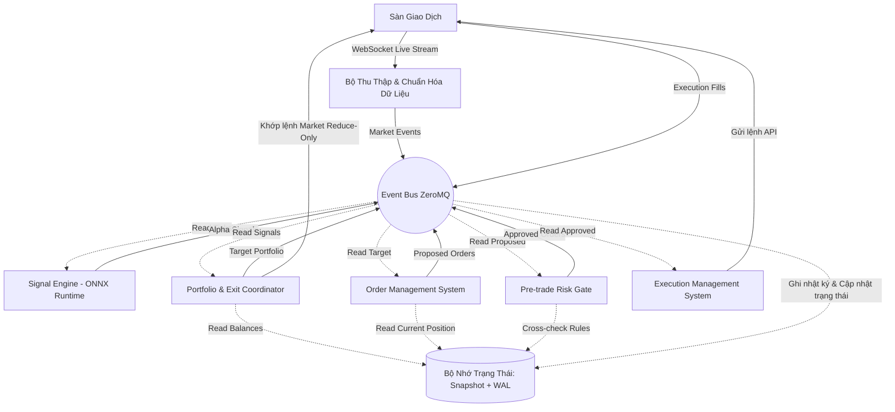

<div align="center">
 


# KAIROS v3
### **Hệ thống giao dịch định lượng (Quant Trading) tần suất trung bình (Mid-Frequency) tự động hóa toàn diện, với kiến trúc độ trễ thấp (Low-Latency)**

[](https://www.python.org/)
[](https://www.binance.com/)
[](https://opensource.org/licenses/MIT)

`Python` • `ZeroMQ` • `Polars` • `ONNX Runtime` • `Quant Analysis`

| Đặc tính | Chi tiết |
|--------|---------|
| Phiên bản tài liệu | v3.10 (Public Edition) |
| Thị trường hỗ trợ | Crypto Perpetual Futures (Binance, Bybit, OKX) |
| Định hướng vận hành | Hệ thống tự động hóa 24/7, tự khôi phục sau sự cố |
| Trạng thái phát triển | Production-Ready (Core Engine & Data Pipeline) |

<div align="left">
 
---

## 1. Tổng Quan Hệ Thống (System Overview)

**KAIROS v3** là một hệ thống giao dịch thuật toán tần suất trung bình (MFT - Mid-Frequency Trading) với horizon giữ vị thế từ 30 phút trở lên. Hệ thống được xây dựng trên triết lý **"Latency-First & Capital Safety"** (Độ trễ tối thiểu và Bảo vệ vốn tối đa), nhằm giải quyết bài toán giao dịch tự động hóa hoàn toàn trên thị trường tiền mã hóa biến động mạnh mà không cần can thiệp thủ công.

### Kiến Trúc Luồng Dữ Liệu Tổng Thể (Conceptual Data Flow)



---

## 2. Các Trụ Cột Công Nghệ & Thành Tựu Kỹ Thuật (Core Engineering Highlights)

Để vận hành an toàn và đạt độ trễ xử lý cực thấp dưới giới hạn của ngôn ngữ Python, KAIROS v3 áp dụng nhiều thiết kế hệ thống chuyên sâu:

### A. Tối Ưu Hóa Độ Trễ Hot-Path (Zero-Allocation Hot Path)
*   **Triệt tiêu Garbage Collection:** Hệ thống tắt hoàn toàn cơ chế thu gom rác tự động của Python (`gc.disable()`) trên phân đoạn Hot-Path để loại bỏ các điểm treo (stop-the-world pauses).
*   **Pre-allocated Memory:** Toàn bộ các vùng đệm nhận dữ liệu, con trỏ sự kiện và các slot bộ nhớ đều được cấp phát tĩnh từ lúc khởi động.
*   **Ctypes Direct Copy:** Dữ liệu sự kiện thô được sao chép trực tiếp vào bộ nhớ thông qua `ctypes.memmove` ở mức thấp, đảm bảo không phát sinh bất kỳ Python object nào trong vòng lặp chính (zero-allocation).

### B. Cơ Chế Concurrency Không Khóa (Lock-Free SPSC Ring Buffer)
*   Hệ thống sử dụng mô hình đa luồng (Multi-threading) tối ưu. Luồng nhận tín hiệu (Thread 1) và Luồng thực thi API (Thread 2) giao tiếp với nhau qua cấu trúc hàng đợi vòng tròn **Single-Producer Single-Consumer (SPSC) Ring Buffer** tự phát triển.
*   Cơ chế này sử dụng kỹ thuật xoay vòng kiểm tra (Hybrid Spin-Wait) và cập nhật chỉ số phiên bản (version-indicator) thay vì tranh chấp Lock của hệ điều hành, giúp giảm độ trễ trao đổi luồng xuống mức nanosecond.

### C. Động Cơ Tính Đặc Trưng Siêu Tốc (Precompiled Feature DAG)
*   Để tính toán các chỉ báo kỹ thuật và đặc trưng (features) thời gian thực mà không tiêu tốn chu kỳ CPU, đồ thị phụ thuộc đặc trưng (DAG) được biên dịch trước thành một danh sách phẳng (Flat execution plan) khi khởi động.
*   Hot-path tính đặc trưng sử dụng cấu trúc bảng định tuyến $O(1)$ (Dispatch Table) thay thế hoàn toàn cho các câu lệnh rẽ nhánh `if/else`, giúp thời gian tính đặc trưng chỉ mất `<10µs` cho mỗi sự kiện thị trường.

### D. Hệ Thống Quản Trị Rủi Ro Độc Lập (Pre-Trade Risk Gate)
*   Mọi lệnh trước khi đẩy lên sàn giao dịch bắt buộc phải đi qua cổng kiểm soát rủi ro **Risk Gate** hoạt động độc lập.
*   Cổng này kiểm tra 17 quy tắc rủi ro nghiêm ngặt (Max Drawdown, Position Exposure, Order Rate Limits, duplicate guard,...) trong vòng `<50µs`.
*   Trang bị tính năng **Emergency Flattener** (Watchdog) hoạt động ngoài tiến trình. Khi phát hiện các sự cố nghiêm trọng (như bất đồng bộ vị thế > $10, lệch đồng hồ NTP > 1ms, mất kết nối mạng diện rộng), Watchdog sẽ tự động kích hoạt đóng toàn bộ vị thế hiện có trên sàn về FLAT thông qua REST pool độc lập và khóa cứng hệ thống để bảo vệ tài sản.

### E. Lưu Trữ Trạng Thái Bền Vững (Durable WAL & Snapshots)
*   KAIROS v3 áp dụng mô hình lưu trữ tương tự cơ sở dữ liệu: Trạng thái vận hành được snapshot định kỳ xuống đĩa và mọi thay đổi trạng thái trung gian đều được lưu vào nhật ký **Write-Ahead Log (WAL)** sử dụng file ánh xạ bộ nhớ (`mmap`) kết hợp mã kiểm tra lỗi `CRC32`.
*   Quy trình khởi động 12 bước SRE-grade tự động quét và đối soát dữ liệu lịch sử WAL, ví sàn và trạng thái lưu trữ để đảm bảo tính toàn vẹn tuyệt đối trước khi cho phép hệ thống giao dịch trở lại.

---

## 3. Kiến Trúc Phân Tầng Logic (Logical Architecture)

Dự án được cấu trúc theo 4 tầng chức năng độc lập nhằm tối đa hóa khả năng bảo trì và nâng cấp:

```
KAIROS v3/
├── Cấu Hình & Runtime (Config & Runtime Layer)
│   ├── Hướng dẫn cấu hình đa tầng (Basic, Advanced, System)
│   └── Môi trường điều phối cách ly (Live Orchestrator, Paper Testing, Backtesting)
│
├── Hồ Dữ Liệu (Data Lake Layer)
│   ├── Dữ liệu thô Parquet (Raw data per exchange/symbol)
│   ├── Feature Store (Offline cache cho training, Online cache trên RAM)
│   └── Trạng thái hệ thống (WAL, Atomic State Snapshots, Audit trails)
│
├── Động Cơ Dữ Liệu & Tính Đặc Trưng (Data Engine & Feature Pipeline)
│   ├── Data Lineage & Point-in-Time Universe Manager (Chống survivorship bias)
│   ├── Bộ thu thập WebSocket/REST đa sàn (Binance, Bybit, OKX)
│   └── Động cơ tính đặc trưng tăng dần (Incremental Feature Engine)
│
├── Nghiên Cứu & Trí Tuệ Nhân Tạo (Research & ML Layer)
│   ├── Khung thẩm định Alpha 3 tầng (T0 Screen -> T1 Validate -> T2 Full Diligence)
│   ├── Bộ kiểm toán rò rỉ dữ liệu (Leakage Audit) và kiểm thử stress test
│   └── Logic huấn luyện mô hình và MLOps Monitor (Feature Drift & Prediction Drift)
│
└── Thực Thi & Quản Trị Rủi Ro (Execution & Risk Core)
    ├── Vòng lặp sự kiện hiệu năng cao (High-performance Event Loop)
    ├── Cổng kiểm soát rủi ro độc lập (Pre-Trade Risk Gate)
    ├── Exit Coordinator (Quản lý và thực thi đóng vị thế tự động)
    └── Các cổng kết nối sàn giao dịch (Exchange Gateways)
```

---

## 4. Công Nghệ Sử Dụng (Technology Stack)

*   **Ngôn ngữ lập trình chính:** Python 3.13+ (với các phần mở rộng tối ưu hóa C-extension và ctypes).
*   **Truyền thông tin:** ZeroMQ (mô hình Pub/Sub cho truyền tin nội bộ hiệu năng cao).
*   **Phân tích & Xử lý dữ liệu:** Polars, PyArrow, SQLite.
*   **Suy luận Học máy:** ONNX Runtime, TensorRT (cho các mô hình học sâu như LSTM, Transformer).
*   **Hệ thống & Lưu trữ:** Memory-mapped files (`mmap`), Parquet format.

---

## 5. Quy Chuẩn Vận Hành Production (Production Readiness Rules)

Hệ thống được thiết kế để tuân thủ các cam kết vận hành nghiêm ngặt sau:

*   **Không override cấu hình rủi ro tại runtime:** Tất cả giới hạn rủi ro (Hard limits) đều được đóng băng sau khi hệ thống khởi động.
*   **Quy tắc bất đồng bộ:** Hệ thống xử lý đóng vị thế (Exit Coordinator) không được phép chia sẻ khóa hoặc block đường đặt lệnh mở vị thế mới (Hot-Path).
*   **Giám sát Parity:** Liên tục so khớp đặc trưng tính toán realtime (online) và đặc trưng tính toán hàng loạt (offline batch) để đảm bảo không có sự sai lệch dữ liệu huấn luyện và chạy thực tế.
*   **Mất kết nối là ngừng giao dịch:** Nếu mất dữ liệu oracle giá quá 500ms hoặc mất kết nối sàn quá 10s, Risk Gate tự động chặn toàn bộ các lệnh mở mới.

---
 
*Tài liệu này được biên soạn cho phiên bản Public của KAIROS v3 nhằm mục đích giới thiệu năng lực thiết kế hệ thống và kỹ thuật phần mềm định lượng chất lượng cao.*