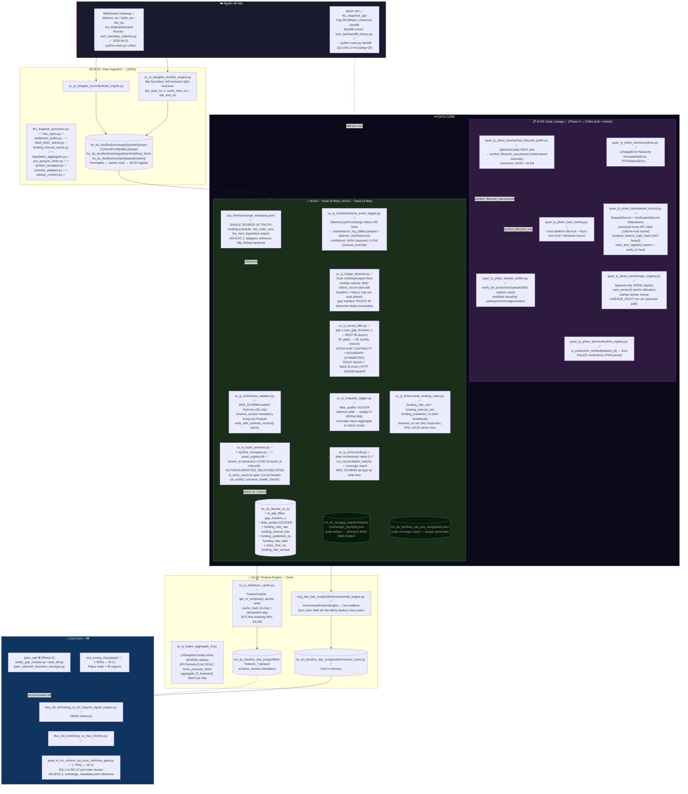
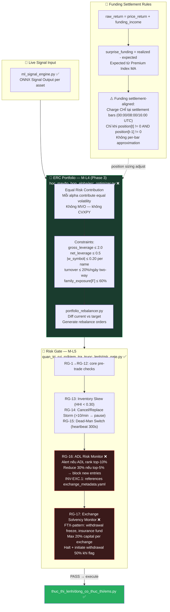
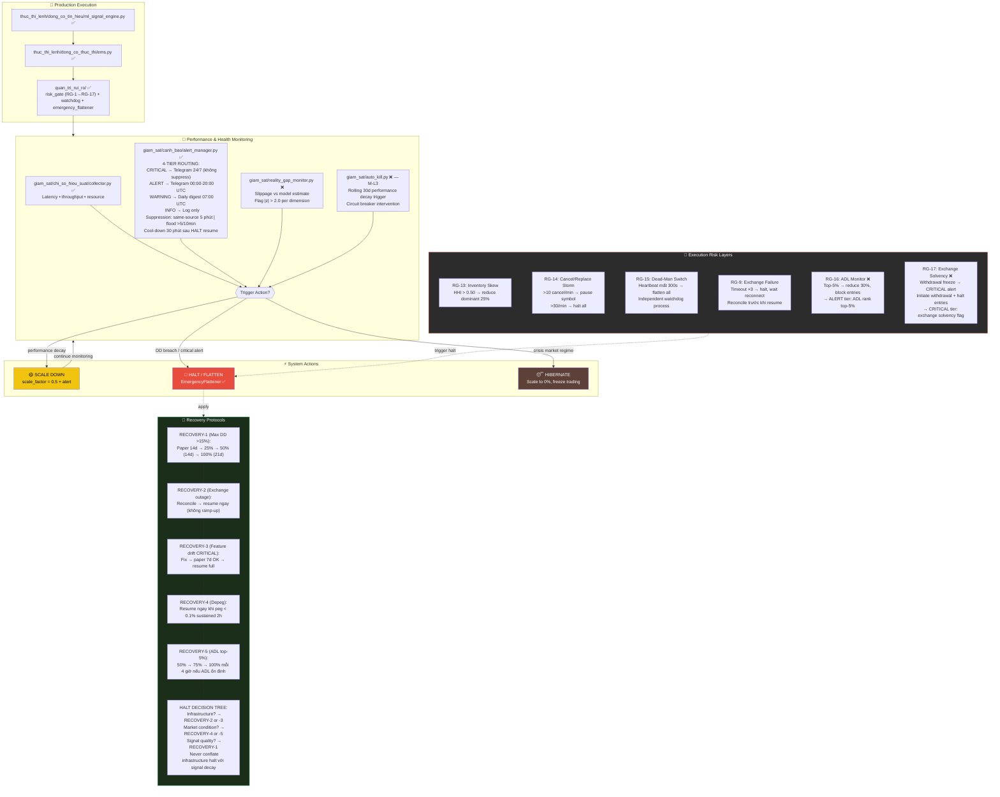
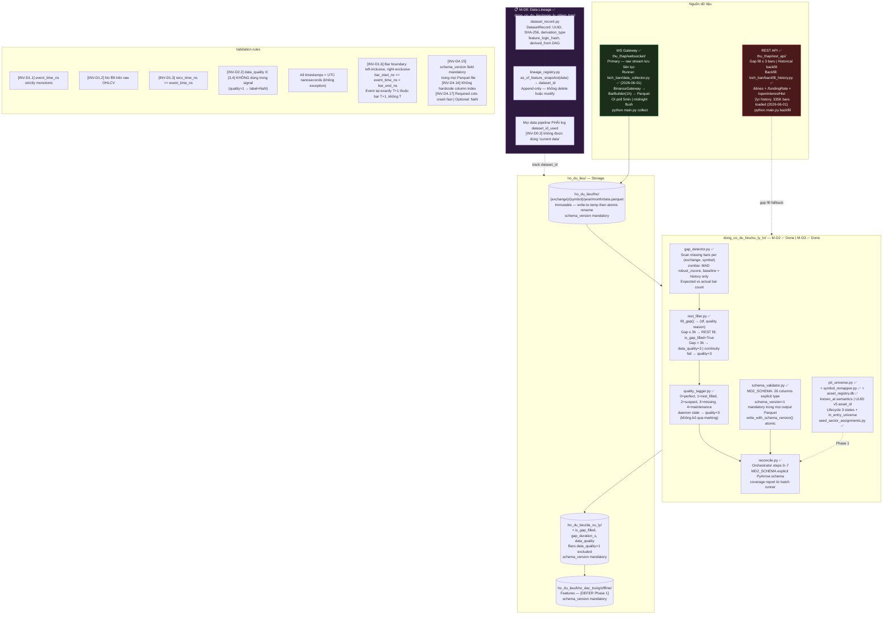

> 📖 **[English Version](data_flow_diagrams.md)**

# KAIROS v3.2 — Sơ đồ luồng dữ liệu & Workflow (Production & Live Core)

> **Ký hiệu:** ✅ = đã có | ❌ = cần build | 🔗 = tái dùng module có sẵn | **[DEFER]** = không cần cho first release

---

## A. Master Data Flow — Toàn cảnh

---

## B. Portfolio Construction & Risk Gate

---

## C. Production Monitoring & Recovery Protocols

---

## D. Data Sourcing & Reconciliation Flow

---

## E. Live Dashboard Spec & Alert Routing

```mermaid
flowchart TB
    subgraph DASH["📊 Live Dashboard — Build TRƯỚC ngày 1 paper trade"]
        direction TB

        subgraph S1["SCREEN 1: HEALTH (daily, ≤60 giây)"]
            direction TB
            H1["Portfolio: PnL today/week | Gross/net leverage | Free collateral"]
            H2["Strategy Status: [F001 LIVE] PnL_30d=X ✅|⚠️ | fills=N"]
            H3["System: Pipeline OK | Feature OK | WAL size | Open orders"]
            H4["Alerts: N CRITICAL, M WARNING | [see digest]"]
            H1 --> H2 --> H3 --> H4
        end

        subgraph S2["SCREEN 2: STRATEGY DETAIL (khi có vấn đề)"]
            direction TB
            AD1["Live performance series last 30d (spark-line)"]
            AD2["Live IC vs baseline: current/target % — target ≥70%"]
            AD3["Fill rate maker actual vs target (≥0.55 BTC/ETH gate)"]
            AD4["TCA: timing_cost | impact_cost | fee split"]
            AD1 --> AD2 --> AD3 --> AD4
        end

        subgraph S3["SCREEN 3: TCA (weekly)"]
            direction TB
            T1["round_trip_cost actual vs model"]
            T2["adverse_selection actual vs model\n(update exchange_metadata khi gap > 30%)"]
            T3["maker_fill_rate by symbol, by hour-of-day"]
            T4["cancel_rate by symbol (alert if > 15%)"]
            T1 --> T2 --> T3 --> T4
        end

        subgraph S4["SCREEN 4: REGIME (weekly)"]
            direction TB
            R1["M-R11 state_vector last 7d:\n  regime: trending/ranging/stressed"]
            R2["ood_score max this week\n  (alert if > 2.5 on 3+ days)"]
            R3["btc_alt_corr rolling 7d\n  (alert if > 0.80 — crisis mode)"]
            R4["funding_extreme: any day funding_zscore > 2.5?"]
            R1 --> R2 --> R3 --> R4
        end

        BUILD_ORDER["Implementation priority:\nWeek 1 paper: Screen 1 + Alerts\nWeek 2: Screen 2 (Strategy Detail)\nWeek 4+: Screen 3 (TCA, sau ≥50 fills)\nMonth 2+: Screen 4 (Regime, sau M-R11 running)"]
    end

    subgraph ALERT_TIER["🔔 Alert Routing (4-tier)"]
        direction TB
        CR["CRITICAL → Telegram 24/7 (không suppress)\n  RG-1→RG-17 halt conditions\n  Dead-man switch fire (RG-15)\n  Exchange withdrawal freeze (RG-17)\n  Pipeline crash (live stream failure)\n  Response: human trong 15 phút"]
        AL["ALERT → Telegram (00:00–20:00 UTC)\n  effective_leverage > 1.8\n  feature drift pct_diff > 10%\n  ADL rank top-5% (RG-16)\n  Performance decay triggered\n  Response: human review trong 2 giờ"]
        WA["WARNING → Daily digest 07:00 UTC\n  feature drift 1–10%\n  clock drift > 500ms\n  cancel rate > 15% (sub-threshold)\n  symbol coverage < 95%"]
        IN["INFO → Log only (không Telegram)\n  normal fills, daily report\n  regime state update"]
        SUPP["Suppression rules:\n  Same-source 5 phút: suppress duplicate\n  Flood >5 ALERT/10 min: aggregate\n  Cool-down 30 phút sau HALT resume\n  CRITICAL: không bao giờ suppressed"]
        CR --- AL --- WA --- IN --- SUPP
    end

    S1 --> S2 --> S3 --> S4
    ALERT_TIER -.->|"feeds alerts"| S1

    style CR fill:#c0392b,stroke:#e74c3c,color:#fff
    style AL fill:#d35400,stroke:#e67e22,color:#fff
    style WA fill:#b7950b,stroke:#f39c12,color:#000
    style IN fill:#1a3c1a,stroke:#27ae60,color:#fff
    style SUPP fill:#1a1a2e,stroke:#3498db,color:#fff
```

